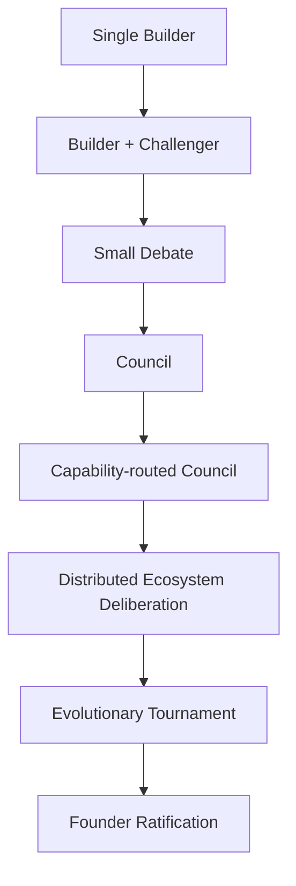

# RB-0001 — Distributed Deliberation Architecture

- **Status:** Research *(Not Proposal — No implementation authorised)*
- **Filed:** 2026-08-05
- **Origin:** Discussion following completion of PAEOS Phase 3.

---

## 1. Observation & Context

Current debate architecture assumes a linear pipeline:
$$\text{Builder} \longrightarrow \text{Adversary} \longrightarrow \text{Founder}$$

This may not be the optimal long-term architecture for autonomous engineering ecosystems.

## 2. Central Question

> **How should autonomous engineering systems deliberate before implementation?**

---

## 3. Candidate Evolution Path

---

## 4. Research Topics

### 1. Steel-topping
- Can multiple critique rounds consistently improve solution quality?

### 2. Council Architecture
- Should debate involve:
  - **Voting**
  - **Evidence aggregation**, or
  - **Negotiated consensus**?

### 3. Capability Routing
- Instead of fixed adversaries ($\text{Builder} \to \text{Adversary}$), allow:
  $$\text{Proposal} \longrightarrow \text{Capability Router} \longrightarrow \text{Best critics in ecosystem}$$
- **Examples:**
  - **Sentium** critiques trading logic.
  - **SAKG** critiques ontology models.
  - **Concept Graph** critiques graph structure.
  - **Library of Fire** critiques historical precedent.
  - **IdeaOS** critiques creativity & novelty.

### 4. Distributed Expertise
- Instead of a single monolithic council ($\text{One Council}$), allow:
  $$\text{Many specialist councils} \longrightarrow \text{Shared ecosystem deliberation}$$

### 5. Evolutionary Deliberation
- Investigate replacing simple debate with:
  $$\text{Proposal} \longrightarrow \text{Counter Proposal} \longrightarrow \text{Simulation} \longrightarrow \text{Tournament} \longrightarrow \text{Evidence} \longrightarrow \text{Merge} \longrightarrow \text{Founder}$$

### 6. Debate Lifecycle
- Determine whether debate belongs:
  - Before planning
  - During planning
  - Before implementation
  - Before sealing, or
  - Continuously.

### 7. Council Memory
- Should councils retain temporary context, institutional memory, or both?
- Relationship to **Ephemeral Execution Context** ($L1$).

### 8. Economic Governance
- How should debates consume **K11 budgets**?
- When is debate economically justified?

### 9. Stopping Criteria
- When should debate terminate?
- **Candidate mechanisms:**
  - Confidence threshold
  - Diminishing returns
  - Bounded turns
  - Founder intervention
  - Evidence convergence

### 10. Cross-Ecosystem Deliberation
- Should **ORCA-strator** coordinate deliberation across **PAEOS**, **Sentium**, **SAKG**, **IdeaOS**, **Library of Fire**, and **Concept Graph**, rather than each system maintaining isolated councils?

---

## 5. Key System Insight

> 💡 **This research may redefine ORCA-strator.**  
> Instead of acting only as a GUI, **ORCA-strator may become the ecosystem-wide capability router and deliberation coordinator.**

---

## 6. Dependencies & Deferral Rationale

- **Dependencies:** Should not be explored until:
  - **SAKG** exists
  - **Concept Graph** exists
  - **ORCA-strator** exists
  - Multiple specialised systems can participate.

- **Why Deferred:** PAEOS currently lacks sufficient ecosystem diversity to determine the optimal deliberation architecture. Real evidence should emerge after building multiple specialised systems.

- **Expected Trigger:** Revisit after completion of **SAKG**, **Concept Graph**, and **ORCA-strator**, or when multiple specialist agents exist.
