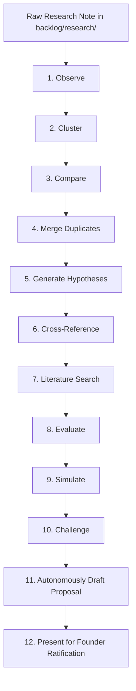

# RB-0002 — Autonomous Research Processing Pipeline (Future Self-Evolution Engine)

- **Status:** Research *(Not Proposal — No implementation authorised)*
- **Filed:** 2026-08-05
- **Origin:** Founder vision for automated research processing following Phase 3.

---

## 1. Observation & Concept

Currently, raw ideas in `backlog/research/` require human or manual triage to become formal proposals (`proposals/`). 

In the future, PAEOS will possess an **Autonomous Research Processing Engine** (an extension of Stage L05 / Evolution Loop) that automatically ingests raw notes, conducts literature searches, simulates outcomes, challenges assumptions, and compiles formal Improvement Proposals for Founder Ratification.

---

## 2. The 12-Stage Autonomous Research Processing Pipeline

---

## 3. Pipeline Stage Specifications

1. **Observe**: Ingest raw research notes and unstructured idea files from `backlog/research/`.
2. **Cluster**: Group related concepts, themes, and capabilities across historical notes.
3. **Compare**: Diff candidate ideas against existing constitutional invariants (`architecture/invariants.json`) and system specs (`spec/`).
4. **Merge Duplicates**: Automatically consolidate redundant or overlapping ideas into unified research tracks.
5. **Generate Hypotheses**: Formulate explicit, falsifiable test vectors and empirical questions ($\Omega$-falsifiers).
6. **Cross-Reference**: Link ideas to existing Improvement Proposals (`proposals/`), Debt items (`ledger/debt/`), and prior task reviews (`reviews/tasks/`).
7. **Literature Search**: Perform automated external research (arXiv, web, open-source benchmarks, prior art) via Stage L05 capabilities.
8. **Evaluate**: Conduct formal trade-off matrix analysis (latency, token economy, complexity, security risk).
9. **Simulate**: Execute isolated sandbox simulations, benchmarks, or code spikes (`reviews/spikes/`) to measure empirical viability.
10. **Challenge**: Run decorrelated adversarial critique (AI-012 / B2.K) to uncover hidden flaws and security vulnerabilities.
11. **Proposal**: Autonomously compile a fully structured `PAEOS-IP-XXXX.md` draft containing explicit boundary conditions and invariant proofs.
12. **Ratification**: Present the finalized, steel-topped proposal to the Founder for A4 decision and sign-off.

---

## 4. Key Ownership Principle

> 💡 **"Raw research capture belongs to the human founder or ecosystem agents; the systematic processing, simulation, and proposal drafting belong to PAEOS."**
