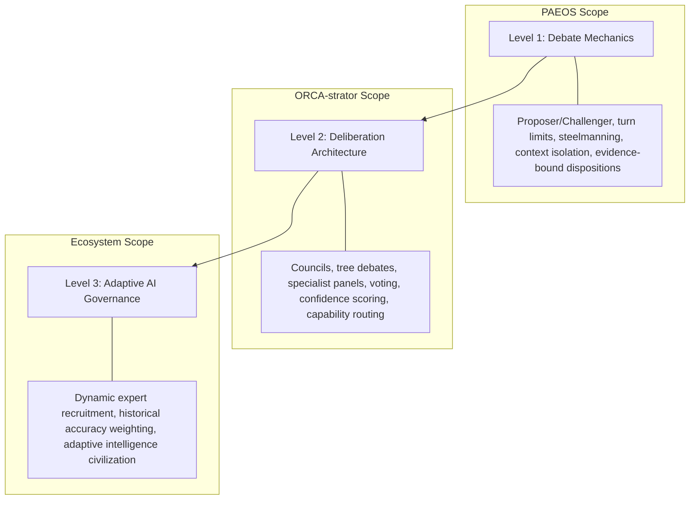
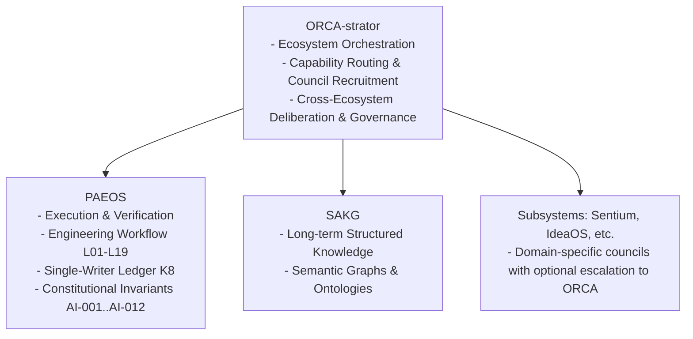

# RB-0003 — Architecture for Collective Intelligence, Deliberation & AI Governance

- **Status:** Research *(Not Proposal — No implementation authorised)*
- **Filed:** 2026-08-05
- **Origin:** Founder & Co-Lead synthesis on multi-agent debate, professional deliberation paradigms, collective intelligence, and adaptive ecosystem governance.

---

## 1. Executive Summary & Core Discovery

A single reasoning trajectory is inherently fragile—whether in human engineering teams or LLM agents. One engineer thinks along one path; bugs and security vulnerabilities hide in the unexamined assumptions they never questioned.

However, "debate" is not a monolithic feature. This research item maps out the full taxonomy of **Collective Intelligence**, spanning three distinct abstraction levels across the ecosystem:

---

## 2. The 3 Abstraction Levels

### Level 1 — Debate Mechanics (PAEOS Scope)
Governs **how one single debate works** between agents:
- Proposer / Challenger dynamics (A-08 / FP-7 decorrelation)
- Context & prompt isolation (preventing scratchpad leaks)
- Mandatory falsification (anti-complacency rules)
- Turn bounds & deadlock prevention
- Objective evidence-bound dispositions (`Accepted`, `Rejected-with-Evidence`, `Deferred`, `Escalated`)

### Level 2 — Deliberation Architecture (ORCA-strator Scope)
Governs **how multiple reasoning paths are organized and combined**:
- Heterogeneous vs. Homogeneous councils
- Capability-routed expert recruitment (e.g. Sentium for trading, SAKG for ontology, Concept Graph for graph structure, Library of Fire for historical precedent)
- Tree debates & recursive debates
- Voting strategies (Majority, Weighted, Confidence-Based, Consensus)

### Level 3 — Adaptive AI Governance (Ecosystem Scope)
Governs **how an intelligence civilization self-organizes and allocates authority**:
- Dynamic recruitment of specialist agents based on problem domain
- Tracking historical prediction accuracy per agent to adjust voting weights dynamically
- Replacing underperforming agents over time
- Adaptive stopping criteria based on expected value of deliberation

---

## 3. Taxonomy of Deliberation Paradigms

Not all debates have the same objective. Professional deliberation falls into 4 primary classes:

| Paradigm Class | Primary Objective | Key Mechanisms | Primary Domain |
| --- | --- | --- | --- |
| **1. Truth Seeking** | Discover empirical correctness | Evidence, logic, experimental proof, changing mind when refuted | Scientific labs, Research |
| **2. Decision Making** | Choose optimal course of action | Trade-off matrices, cost-benefit scoring, consensus | Boardrooms, Operations |
| **3. Stress Testing** | Expose hidden vulnerabilities before reality does | Red Teaming, Pre-mortems, Devil's Advocate, Socratic challenge | Engineering reviews, Security audits |
| **4. Persuasion** | Convince an audience/judge | Rhetoric, framing, emotional appeal | Public policy, Legal advocacy |

*Note: Engineering systems like PAEOS & ORCA operate strictly under **Truth Seeking** and **Stress Testing**.*

---

## 4. The 8 Sub-Research Domains

### Domain 1: Debate Protocols & Mechanics
- Steelmanning (requiring critics to state the strongest version of a proposal before attacking).
- Cross-examination and multi-turn rebuttal bounds.
- Evidence-bound disposition logging (replacing subjective concurrence).

### Domain 2: Council Architectures & Aggregation
- **Majority Vote**: Effective for factual consensus; prone to monoculture bias.
- **Weighted Vote**: Calibrated by domain expertise weights.
- **Confidence-Weighted Aggregation**: Agents output self-calibrated confidence scores ($p_{\text{certainty}}$).
- **Consensus Gate**: Zero progression until total agreement (slow, high safety).

### Domain 3: Specialist Ecosystems & Capability Routing
- Dynamic recruitment of domain specialists:
  - **Sentium**: Critiques financial & trading logic.
  - **SAKG**: Critiques ontology models & semantic graphs.
  - **Concept Graph**: Critiques structural graph relations.
  - **Library of Fire**: Critiques historical precedents.
  - **IdeaOS**: Critiques novelty & creative alternatives.

### Domain 4: Collective Intelligence & Heterogeneity
- **Homogeneous Councils** (e.g. 5× Claude): Consistent reasoning, shared blind spots.
- **Heterogeneous Councils** (e.g. Claude + Gemini + Qwen + DeepSeek): Decorrelated training data, higher coverage of edge cases.
- **Cognitive Roles**: Assigning explicit roles (`Builder`, `Critic`, `Synthesizer`, `Skeptic`, `Evidence Keeper`, `Devil's Advocate`, `Historian`, `Optimizer`, `Judge`, `Moderator`).

### Domain 5: Adaptive AI Governance & Authority Weighting
- Measuring agent historical accuracy across past task reviews (Stage L17).
- Adjusting voting influence based on empirical performance rather than static prompt authority.
- Self-pruning and replacing underperforming agents.

### Domain 6: Human & Professional Debate Paradigms
- Adapting proven human frameworks: **Delphi Method** (anonymous expert rounds to remove authority bias), **Pre-mortems** (assuming failure to work backward), and **Red Team vs. Blue Team**.

### Domain 7: Pathology & Failure Modes
- Cataloging and mitigating multi-agent failure modes:
  - Complacent concurrence ("Looks good to me")
  - Infinite ping-pong / deadlock
  - Echo chambers & monoculture bias
  - Authority bias & eloquent hallucination

### Domain 8: Deliberation Economics
- Integrating K11 economic governance with deliberation spend.
- Calculating the **Expected Value of Additional Deliberation (EVAD)** to halt when marginal quality gains drop below token cost.

---

## 5. Ecosystem Layering Architecture

To preserve PAEOS's architectural stability, these domains are partitioned cleanly across the ecosystem:

---

## 6. Execution Strategy & Non-Destabilization Rule

> ⚠️ **IMPORTANT GOVERNANCE RULE**:  
> **Do NOT attempt to implement all 8 research domains into PAEOS simultaneously.** PAEOS must remain a clean, deterministic execution & verification kernel.

- **PAEOS Core**: Retains `AI-012 (Independent Reasoning Invariant)` and `IP-0013` (Dialectic Proposer/Challenger pairs).
- **Future Ecosystem Expansion**: Broader council architectures, capability routing, and adaptive governance belong in **ORCA-strator** and **SAKG** once those systems exist.
