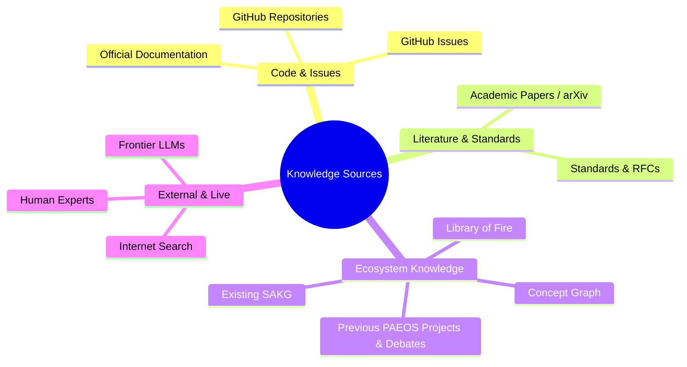
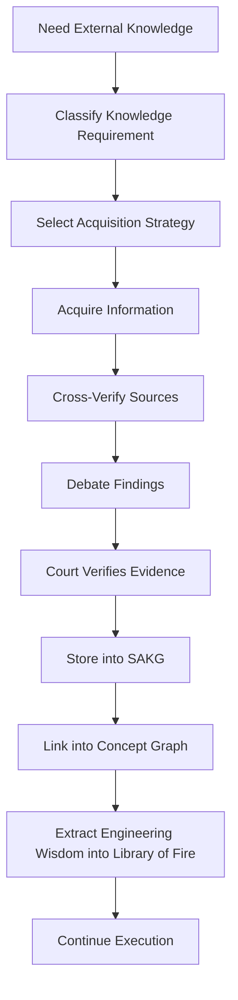

# RB-0004 — Knowledge Acquisition Engine (KAE)

- **Status:** Research Backlog *(Not Proposal — No implementation authorised)*
- **Priority:** High *(Post-SAKG)*
- **Filed:** 2026-08-05
- **Origin:** Discovery during PAEOS Phase 3 completion regarding external knowledge boundary conditions.

---

## 1. Motivation

While building PAEOS, it became apparent that the system possesses excellent execution, governance, verification, debate, and memory capabilities, but currently assumes that relevant knowledge already exists within:
- The local repository
- The constitution
- SAKG (future)
- The human user
- Pre-trained frontier AI models

When PAEOS begins building completely new systems, it will eventually encounter questions whose answers do not exist locally. This raises a fundamental architectural question:

> **How should an autonomous engineering operating system acquire new knowledge?**

---

## 2. Core Question & Observation

### Core Question
Should knowledge acquisition be considered a first-class subsystem of PAEOS, or should it belong elsewhere within the ecosystem (e.g. ORCA-strator, SAKG, or Library of Fire)?

### Observation
Current frontier models appear to "already know" enormous amounts of information. However, this is a hidden, uncalibrated capability. PAEOS currently has no explicit reasoning process for deciding:
- Where knowledge should come from
- Which source is authoritative
- When multiple sources disagree
- When knowledge should become permanent institutional memory
- Whether retrieved knowledge is implementation guidance or constitutional guidance

---

## 3. Potential Knowledge Sources

The acquisition mechanism must not be hardcoded to a single provider or vendor:

---

## 4. Fundamental Architectural Problems

How does PAEOS determine:
1. **Routing**: Where to search first?
2. **Trustworthiness**: Whether retrieved knowledge is sufficiently reliable?
3. **Freshness**: Whether information is outdated or deprecated?
4. **Consensus**: How to resolve contradictions when multiple sources disagree?
5. **Debate Trigger**: Whether new knowledge should trigger a Proposer-Challenger debate?
6. **Persistence**: Whether new knowledge becomes permanent memory ($L3/L4$)?
7. **Scope**: Whether retrieved knowledge is implementation-level guidance ($L1$) or constitutional-level guidance ($L4$)?

---

## 5. Key Research Questions

- Should knowledge acquisition itself become another planning problem?
- Should providers compete or be dynamically selected?
- Should acquisition be budget-aware under K11?
- Should acquisition become another dedicated worker role?
- Should research findings themselves undergo adversarial debate?
- Should evidence acquisition have its own constitutional lifecycle?
- Can acquisition continuously improve itself via Stage L17 learning?

---

## 6. Long-Term Vision Workflow

Eventually, an autonomous engineering workflow might resemble:

---

## 7. Architectural Deferral Rationale

This item is intentionally **not a proposal**. No architecture is assumed, and no implementation is suggested.

> 💡 **Core Constitutional Rationale:**  
> **This backlog item exists because building PAEOS revealed a new class of architectural problem that only becomes visible once an engineering operating system begins constructing systems beyond itself. It is therefore intentionally deferred until sufficient implementation evidence exists to derive, rather than invent, the correct architecture.**

---

## 8. Expected Trigger
Revisit after completion of **SAKG**, **Concept Graph**, and **ORCA-strator**, or when multiple specialist systems exist.
