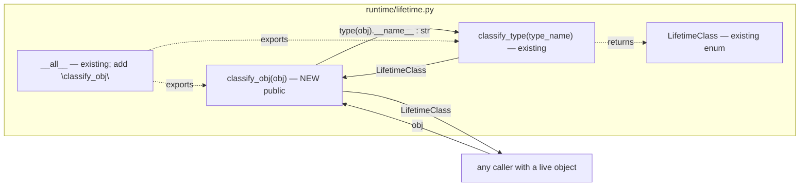
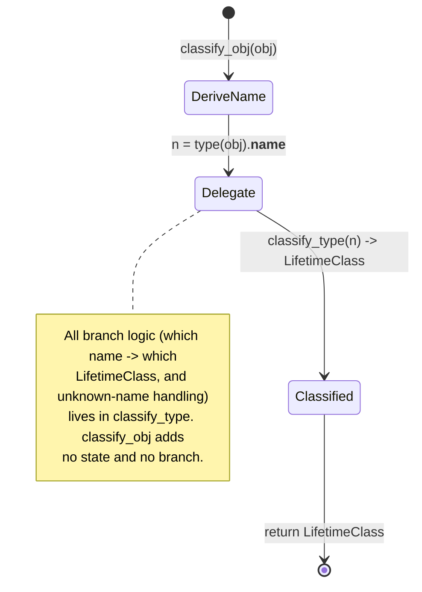

# DESIGN — `classify_obj` lifetime accessor (`runtime/lifetime.py`)

| | |
|---|---|
| **Artifact** | System design for adding `classify_obj` to the runtime lifetime module |
| **Stage / Role** | `DESIGN` / `PLANNER` (PAEOS-7.6 §3) |
| **Status** | DESIGN ONLY — no implementation. This artifact is the frozen input to the downstream `IMPLEMENT` (BUILDER) and `VERIFY` (VERIFIER) stages. |
| **Date** | 2026-08-02 |
| **Required evidence** | `design_coherent` — assumptions surfaced (PAEOS-6), perspectives covered, no orphan/gap. |

---

## 0. Scope boundary (read first)

This worker session is **PLANNER @ DESIGN** with write-capability limited to `design/`
and read-capability limited to `constitution/`, `spec/`, `design/`. The goal objective
names two downstream actions that this stage **does not and must not perform**:

1. **Edit `runtime/lifetime.py`** — that is a `runtime/`-tree write, owned by
   **BUILDER @ IMPLEMENT** (PAEOS-7.6 §3 `StageId.IMPLEMENT`, `Role.BUILDER`). It is
   outside this session's write-capability; any such write is discarded as a violation.
2. **Run the court verification command** — that presupposes the implementation exists
   and produces `VERIFY`-stage evidence (`classify_obj-verified`), owned by
   **VERIFIER @ VERIFY** (`StageId.VERIFY`, `Role.VERIFIER`). Running it now would fail
   (the function does not yet exist) and, worse, would misrepresent build-stage evidence
   as design output. The four-tuple transition contract (PAEOS-7.6 §4) exists precisely
   to keep these powers separated; honoring it is the disciplined outcome here.

This document is therefore the **hand-off spec**: it defines the change with enough
precision that IMPLEMENT can realize it mechanically and VERIFY can run the exact court
command unchanged. Evidence emitted by this session is `design_coherent` (this file),
**not** `classify_obj-verified`.

---

## 1. Component graph

The change is a single new pure function in the existing `runtime/lifetime` module. It
adds **one intra-module edge** (`classify_obj → classify_type`) and depends on the Python
builtin `type`/`__name__`. It introduces **no new module** and **no new import**.



**Rationale for placement.** `classify_obj` is the *object-level* adapter over the
existing *type-name-level* primitive `classify_type`. Co-locating it in `runtime/lifetime.py`
keeps the classification authority in one module (single source of truth for the
`LifetimeClass` mapping) and avoids a new dependency edge from callers to the string form.
No orphan is created: the function is reachable from `__all__` and calls an existing
in-module function.

---

## 2. Interface contract

Language-neutral shape (PAEOS-7.6 §1 notation), reference target is Python.

```
# NEW — public
classify_obj(obj: object) -> LifetimeClass
    # Definition:  classify_obj(obj) == classify_type(type(obj).__name__)
    # Purity:      total, side-effect-free, deterministic for a given (obj-type) input.
    # Domain:      any object whose runtime type has a name known to classify_type.
    # Delegation:  performs no classification itself — it derives the type *name*
    #              and forwards to the existing classify_type primitive verbatim.

# EXISTING — depended upon (treated as fixed interface; see Assumption A1)
classify_type(type_name: str) -> LifetimeClass
LifetimeClass  # closed enum; includes at least L1 (see Assumption A2)

# EXISTING — module export list, to be extended
__all__  # append the string "classify_obj"
```

**Exact behavioral requirement for IMPLEMENT.** The body is *precisely*
`return classify_type(type(obj).__name__)` — nothing more. `classify_obj` MUST NOT
re-derive, cache, normalize, or special-case; it inherits every mapping and every edge
case (including unknown-type handling) from `classify_type`. This makes the two functions
mapping-equivalent by construction: `classify_obj(x)` and `classify_type(type(x).__name__)`
return the identical `LifetimeClass` for all `x`.

**Exact export requirement.** Add the literal string `"classify_obj"` to the module's
`__all__` sequence. Do not remove or reorder existing entries.

---

## 3. Data flow

```
caller ── obj:object ──▶ classify_obj
                          │  n := type(obj).__name__     (builtin, str)
                          ▼
                        classify_type(n) ── LifetimeClass ──▶ classify_obj ──▶ caller
```

- **Input:** a single live object `obj`. Only its runtime type's `__name__` is consulted;
  the object's *value/contents are never inspected* — so the function is safe on objects
  with side-effecting `__eq__`/`__repr__` and carries no data-sensitivity concern.
- **Transform:** `type(obj).__name__` is a pure builtin read yielding the unqualified
  class name as `str`.
- **Output:** the `LifetimeClass` returned by `classify_type` for that name, returned
  unmodified.

**No hidden state, no I/O, no capability required.** This is a Z-agnostic pure helper; it
crosses no trust boundary and thus needs no `CapabilityToken` (PAEOS-7.6 §1
`[capability-gated]` does not apply).

---

## 4. State machine / decision flow

`classify_obj` is stateless; the only "machine" is the classification decision, wholly
owned by `classify_type`. Modeled for completeness (no orphan states):



The single acceptance-relevant path is the worked example from the court command:

```
obj = ExecutionContext()                     # runtime.task_package
type(obj).__name__ == "ExecutionContext"
classify_type("ExecutionContext") == LifetimeClass.L1   # by existing rule (Assumption A3)
∴ classify_obj(ExecutionContext()) is LifetimeClass.L1
```

---

## 5. Assumptions surfaced (PAEOS-6)

| id | Assumption | Why it is an assumption / verification owner |
|----|------------|----------------------------------------------|
| **A1** | `classify_type(type_name: str) -> LifetimeClass` already exists in `runtime/lifetime.py` with a stable signature. | `runtime/` is outside this session's read-capability; taken from the goal objective as authoritative. IMPLEMENT confirms against the real module. |
| **A2** | `LifetimeClass` is a closed enum exposing at least member `L1` (naming suggests an L1/L2/L3 lifetime tiering). | Same read-scope limit; the court command imports `LifetimeClass` and dereferences `.L1`, which fixes this. |
| **A3** | The existing `classify_type` maps `"ExecutionContext"` → `LifetimeClass.L1`. | Governed by `constitution/classifier_rules/` + existing module logic; `classify_obj` inherits it and adds no new rule (respects I7/K6: no new rule without a scar). |
| **A4** | `__all__` is a list/tuple of `str` in the module and is the intended export surface. | Standard for this codebase; IMPLEMENT appends `"classify_obj"`. |
| **A5** | `ExecutionContext` is importable from `runtime.task_package` and constructible with no args (`ExecutionContext()`). | Court command relies on this exact form; a no-arg constructor is presumed. VERIFIER owns the runtime check. |

None of A1–A5 changes the design; each is a fact the downstream stages *confirm*, and the
design is correct under every stated assumption.

---

## 6. Perspectives covered (multi-perspective critique input, L09)

- **Correctness:** `classify_obj` is mapping-equivalent to `classify_type ∘ (type · __name__)`
  by construction (§2); the acceptance example resolves to `L1` (§4). ✔
- **Security / trust-zone:** pure, no capability, no I/O, no boundary crossing; inspects
  only the type name, never object contents (§3). No new attack surface. ✔
- **Blast radius (A-2):** additive change — one new function + one `__all__` entry, no edit
  to existing behavior, non-TCB (`runtime/`, not `constitution/`). Kernel-classification
  expected **SOFT**. No amendment path required. ✔
- **Maintainability / DRY:** delegation keeps the `LifetimeClass` mapping single-sourced in
  `classify_type`; `classify_obj` will not drift from it. ✔
- **Testability / verifiability:** the exact court command is specified in §7 and is
  runnable unchanged once IMPLEMENT lands. ✔
- **Backward compatibility:** existing exports untouched; only an addition to `__all__`. ✔

## 7. Verification hand-off (for VERIFIER @ VERIFY — not run in this stage)

The design is realized correctly iff the following court command exits `0` and prints
`classify_obj-verified`:

```
/Users/bob/GitHub/paeos/.venv/bin/python -c "from runtime.lifetime import classify_obj, LifetimeClass; from runtime.task_package import ExecutionContext; assert classify_obj(ExecutionContext()) is LifetimeClass.L1; print('classify_obj-verified')"
```

This command is recorded here as the acceptance oracle. It is **not executed by this
DESIGN session** (see §0); it is executed by the VERIFY stage after IMPLEMENT adds
`classify_obj` and its `__all__` entry.

## 8. IMPLEMENT checklist (hand-off)

1. In `runtime/lifetime.py`, add the public function:
   `def classify_obj(obj: object) -> LifetimeClass: return classify_type(type(obj).__name__)`.
2. Append the literal `"classify_obj"` to the module `__all__`.
3. Change nothing else in the module.
4. Hand to VERIFY to run the §7 court command.

---

**No orphan / no gap:** every declared component (§1) is reachable and exported; every
data element (§3) is produced and consumed; every state (§4) has an entry and exit; every
assumption (§5) has a downstream verification owner. Evidence for this gate:
`design_coherent` = this file.
