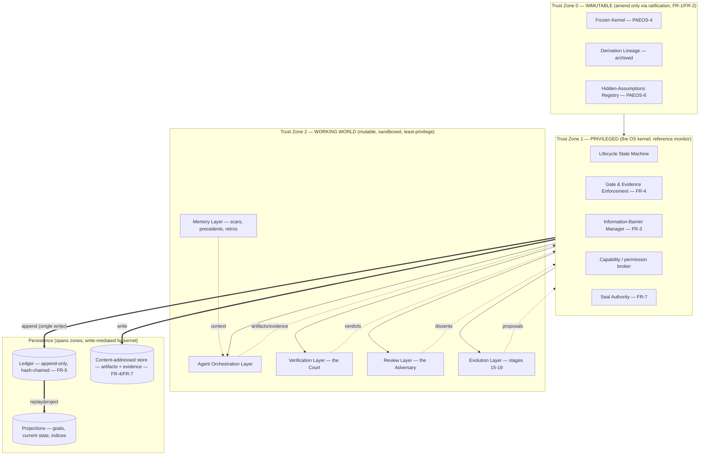
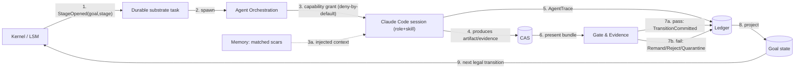
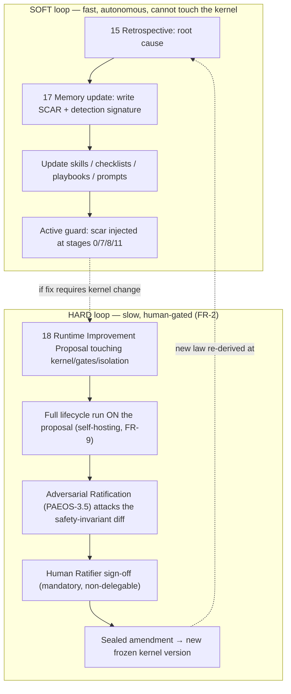

# PAEOS-7 — Runtime Architecture Specification

| | |
|---|---|
| **Artifact** | PAEOS-7 — Runtime Architecture |
| **Position in lineage** | Successor to PAEOS-6 (Hidden Assumptions). First artifact of the *executable* layer. |
| **Status** | Draft for adversarial ratification (PAEOS-3.5). Not yet sealed. |
| **Scope** | Architecture only. **No implementation code.** This specifies *what the runtime is and why*, precisely enough that builder agents (Phase 1) can derive `PAEOS-8` implementation packages from it. |
| **Governs** | The transformation of the 20-stage constitutional lifecycle from a human workflow into an executable AI engineering operating system. |
| **Does not govern** | The constitution itself (PAEOS-0…6). This artifact executes *under* the constitution and may not amend it except through the ratification path defined in §7.4. |
| **Prime directive** | Optimize for correctness. Where a cheaper design would violate a constitutional property, the expensive design wins; cost is managed by *scoping* (triage), never by *weakening gates*. |
| **Companion artifacts** | **PAEOS-7.5** (Runtime Threat Model) attacks whether this runtime *honors* the constitution once executing; **PAEOS-7.6** (Runtime Interface Contracts) is the wire-level form of every boundary here. Changes forced back into this document by PAEOS-7.5 are tagged `[Δ7.5]`. |

---

## 0. Reading order

1. **§1 Forcing requirements** — the constitutional properties that dictate the architecture. Everything downstream is derived from here. Read this first; if you disagree with a forcing requirement, stop and dispute it, because the rest follows from it.
2. **§2 Integration decision** — build-vs-buy, derived cold. Justifies why the substrate is what it is.
3. **§3–§6** — the architecture proper (runtime, workflow engine, agents, storage).
4. **§7** — self-improvement (the reason PAEOS exists).
5. **§8** — roadmap (Phase 0→3), the executable plan.
6. **§9** — the architecture attacks itself. **This section changed the design in §3–§8; the changes are marked `[Δ9.x]` where they appear.**
7. **§10** — residual risk & deferred decisions. **§11** — glossary.
8. **Then read the companions:** **PAEOS-7.5** (threat model — the runtime's own assumptions under attack) and **PAEOS-7.6** (interface contracts — what builder agents implement). This document is the *why*; 7.6 is the *shape*; 7.5 is the *adversary*.

## Table of contents

- [1. Forcing requirements](#1-forcing-requirements)
- [2. Integration decision (derived cold)](#2-integration-decision-derived-cold)
- [3. Runtime architecture](#3-runtime-architecture)
- [4. Workflow execution engine](#4-workflow-execution-engine)
- [5. Agent architecture](#5-agent-architecture)
- [6. Storage architecture](#6-storage-architecture)
- [7. Self-improvement architecture](#7-self-improvement-architecture)
- [8. Implementation roadmap](#8-implementation-roadmap)
- [9. Adversarial self-review](#9-adversarial-self-review-attack-before-finalizing)
- [10. Residual risk & deferred decisions](#10-residual-risk--deferred-decisions)
- [11. Glossary](#11-glossary)

---

## 1. Forcing requirements

The architecture is not a free choice. Each load-bearing property of the runtime is *forced* by a property of the constitution. If we drop the requirement, we may drop the mechanism — not before. This table is the spec's spine; every later section cites back to an `FR-n`.

| ID | Constitutional property (source) | What it forces on the runtime | Mechanism (where designed) |
|----|----------------------------------|-------------------------------|----------------------------|
| **FR-1** | **Frozen Kernel** (PAEOS-4) — a set of rules the system may not change while running. | A hard privilege boundary: the runtime executes *under* rules it cannot edit. Kernel is read-only to all autonomous agents; changing it is a different, heavier process than doing work. | Constitution Layer + Reference Monitor (§3.2, §3.3); Amendment path (§7.4) |
| **FR-2** | **Adversarial Ratification** (PAEOS-3.5) — constitutional change requires an independent adversary to fail to break it. | Two distinct execution modes: *ordinary work* (soft loop) and *constitutional change* (hard loop with ratification + human sign-off). The runtime cannot self-amend autonomously. | Dual-loop self-improvement (§7); Amendment gate (§4.3) |
| **FR-3** | **Independent Adversarial Review** (lifecycle stage 12) — review must be *independent*, not the builder grading its own homework. | Structural isolation: the adversary must not share context, incentive, scratchpad, or reasoning lineage with the builder. Independence must be *enforced by construction*, not by instruction. | Information-Barrier Manager (§3.2); Review Layer (§3.6); Separation of Powers (§5.1) |
| **FR-4** | **Verification Court** (stage 11) — outcomes are adjudicated on *evidence*, burden of proof on the proponent. | Every gate is *evidence-gated*: a transition is illegal without a referenced, reproducible evidence bundle. Claims without evidence do not advance. | Gate & Evidence enforcement (§4.3); Evidence store (§6) |
| **FR-5** | **Ledger + Ledger Synchronization** (stage 13) — an authoritative, reconcilable record. | An append-only, tamper-evident, totally-ordered log as the single source of truth. State is a *projection* of the log, never the primary. Non-repudiation. | Persistence model / event sourcing (§3.5, §6) |
| **FR-6** | **Scars** (constitutional memory) — the system remembers where it was hurt and refuses to repeat it. | A queryable failure memory with *detection signatures* that are automatically matched against new work at re-derivation, critique, and verification time. A past failure becomes an *active guard*, not a diary entry. | Memory Layer (§3.7); Self-improvement (§7.1) |
| **FR-7** | **Seal / Promote / Reject** (stage 14) — a finalization that is attested and immutable. | Idempotent, signed finalization committed to the ledger. Sealed artifacts are frozen; "changing" a sealed artifact means *superseding* it, never mutating it. | Seal Authority (§3.2); Rollback semantics (§4.5) |
| **FR-8** | **First-Principles Re-derivation** (stage 0) — every run re-derives from the constitution rather than trusting cached conclusions. | The runtime must not hard-code conclusions that stage 0 is meant to re-derive. Constitution must be *queryable*; conclusions are *cache-invalidatable*; evidence may be cached but *derivations may not be trusted stale*. | Constitution MCP (§2, §3.2); cache policy (§9.4) |
| **FR-9** | **Evolution Loop + Lifecycle Re-execution** (stages 16, 19) — the system runs its own lifecycle on itself. | The runtime must be **self-hostable**: the runtime itself is a legal goal in its own backlog. No mechanism may exist that only humans (never the lifecycle) can exercise, *except* the FR-2 amendment sign-off. | Self-hosting (§8, Phase 2); Evolution Layer (§3.8) |
| **FR-10** | **Multi-perspective Critique** (stage 8) + **Hidden Assumptions** (PAEOS-6) — surfaced assumptions and plural viewpoints before commitment. | A cooperative internal critique stage *distinct from* the hostile independent review, plus an assumptions registry consulted at design time. Critique is cheap and early; adversary is expensive and late. | Critic role (§5.2); Ideation Chamber (§4.1) |

**Derived meta-requirement (MR).** FR-3 + FR-4 + FR-7 together force **Separation of Powers**: the agent that *builds* cannot be the agent that *verifies*, cannot be the agent that *adversarially reviews*, cannot be the authority that *seals*. This single principle (§5.1) is the most important safety property in the system and is referenced throughout.

---

## 2. Integration decision (derived cold)

The brief forbids assuming LangGraph. We evaluate all four candidates **against the forcing requirements**, not against popularity. The question is decomposed, because "orchestration" is four different jobs that different tools do well:

1. **Durable lifecycle execution** — long-running (hours→days), resumable, human-in-loop, crash-safe state machine.
2. **Agent runtime** — where an individual agent actually reasons, reads/writes files, runs tests, calls tools.
3. **Procedure encoding** — how a lifecycle stage's method (e.g. "how to run a Verification Court") is expressed, versioned, and improved.
4. **Substrate access** — how agents read the constitution, append to the ledger, query scars, fetch artifacts — *under permission*.

### 2.1 Candidate evaluation

| Candidate | Job it's actually good at | Score against FRs | Verdict |
|-----------|---------------------------|-------------------|---------|
| **LangGraph** | In-process agentic graphs with shared mutable state; fast to prototype a multi-node reasoning flow. | **Fails FR-3 by default:** its value proposition is a *shared state object* passed between nodes — the opposite of the information barrier the adversary requires; you would spend your effort *fighting* the framework to isolate context. **Weak on FR-5/FR-7:** no native tamper-evident ledger or idempotent seal; state is a graph checkpoint, not an auditable log. **Partial on durable HITL.** | **Rejected as the substrate.** Permitted *inside a single agent* as a local reasoning subgraph (optional, Phase 2+). Not the orchestrator. |
| **Durable-execution engine** (Temporal-class: Temporal / Restate / DBOS) | Crash-safe, resumable, idempotent long-running workflows; timers; human-in-loop signals; deterministic replay. | **Strong on job (1) and FR-5-adjacent needs** (deterministic replay pairs naturally with an event-sourced ledger). Neutral on FR-3 (isolation is our job, not the engine's). Does not know anything about constitutions — correctly, it shouldn't. | **Adopt as the durability substrate** for the kernel — *behind* our own state machine, from Phase 1. MVP may stub it with an event-sourced Postgres loop (§8, Phase 0) to avoid premature ops burden. |
| **Claude Code** | An agent that reasons, edits files, runs commands/tests, respects tool-permission scoping and sandboxed workspaces. | **Strong on job (2).** Its permission model + sandboxed workspace is *exactly* the enforcement surface FR-3 and MR (separation of powers) need at the agent boundary. Builder agents in particular want this environment. | **Adopt as the agent runtime.** Every agent role (§5) is a Claude Code session with a role-scoped skill set, filesystem scope, and MCP allow-list. |
| **Skills** | Reusable, versionable procedures an agent loads to perform a task a specific way. | **Strong on job (3) and FR-8/FR-9:** encoding each lifecycle stage + each agent role as a skill makes methods *versioned artifacts the runtime can improve* (stage 18) and *re-derive against* (stage 0). | **Adopt for procedure encoding.** One skill (or skill set) per stage and per role. Skill versions are recorded in every agent trace. |
| **MCP** | Uniform, permissioned tool/context access across agents and hosts. | **Strong on job (4) and FR-1/FR-4/FR-5/FR-6:** the substrate (constitution, ledger, evidence, memory, court) is exposed as MCP servers; an agent's *role is enforced by which MCP servers it is granted*. This is the reference-monitor's teeth at the tool layer. | **Adopt for substrate access.** Deny-by-default; the kernel issues per-session, per-role MCP capability grants. |
| **Custom orchestration kernel** | Nothing off-the-shelf: frozen-kernel enforcement, evidence gates, information barriers, seal/ledger semantics, separation-of-powers scheduling. | These *are the constitutional value* and are too specific to delegate. But it must stay **thin**: a reference monitor + state machine, not a god object (§9.3). | **Build.** This is the only genuinely custom component and the system's moat. |

### 2.2 Verdict

> **The runtime is a thin custom Orchestration Kernel (the constitutional reference monitor + lifecycle state machine) sitting on a durable-execution substrate, driving Claude Code agent sessions whose methods are Skills and whose substrate access is permissioned MCP.**
>
> LangGraph is explicitly evaluated and **not** used as the orchestrator — its shared-state model is actively hostile to the independence requirement (FR-3), and it offers nothing for the ledger/seal requirements (FR-5/FR-7). It is optionally admissible only as an intra-agent reasoning aid.

**Build vs. buy, one line:** *Build the constitution; buy the plumbing.* We build only what encodes constitutional law (kernel, gates, barriers, seals, scar-matching). We buy durability, the agent runtime, and tool access. `[Δ9.3: this boundary is what keeps the kernel from becoming a god object.]`

---

## 3. Runtime architecture

### 3.1 Layer model

The runtime is nine layers in three trust zones. Trust decreases outward from the constitution; the kernel is the only component that spans the boundary between the immutable substrate and the mutable working world, and it does so as a *reference monitor* (all privileged action passes through it). These nine *logical* layers compile into three *physically* separated codebases — the **Kernel**, the **Runtime**, and the **hosted Agent layer** — decomposed in §3.9.



### 3.2 Core components — purpose, boundary, responsibility

| Component | Layer/Zone | Purpose | Hard boundary (what it must *not* do) |
|-----------|-----------|---------|----------------------------------------|
| **Constitution Store** | Z0 | Serve the frozen kernel, lineage, and hidden-assumptions registry as read-only, queryable law (via `constitution` MCP). | Must never be writable by an autonomous agent. Writes only via a sealed amendment transaction (§7.4). |
| **Lifecycle State Machine (LSM)** | Z1 | Own the authoritative state of every goal across the 20 stages; compute legal transitions; schedule stage execution on the durable substrate. | Contains **no** agent logic and **no** verification logic. It decides *what happens next*, never *how a stage is performed*. |
| **Gate & Evidence Enforcement** | Z1 | Refuse any transition whose evidence bundle is missing, unreproducible, or fails the gate's pass-criterion (FR-4). | May not *produce* evidence. It only *checks* evidence produced by the working world. It cannot be bypassed by any agent. |
| **Information-Barrier Manager (IBM)** | Z1 | Enforce FR-3: decide, per role and per goal, what context/evidence an agent session may receive; construct the *sealed evidence bundle* the adversary sees. | May not leak builder reasoning to the adversary, or adversary findings back to the builder before verdict. Barrier config is kernel law, not agent-editable. |
| **Capability / Permission Broker** | Z1 | Mint per-session, per-role, deny-by-default capability grants: which MCP servers, which filesystem scope, which skills, which kernel APIs (the reference monitor). | May not grant a capability outside a role's declared set (§5.2). No self-grant, no escalation. |
| **Seal Authority** | Z1 | Perform idempotent Seal/Promote/Reject: hash the artifact + its full evidence/verdict/dissent bundle, sign it, commit the seal to the ledger (FR-7). | May not seal without a passing court verdict *and* a resolved adversarial review. Sealing is the *only* way an artifact becomes canonical. |
| **Agent Orchestration Layer (AOL)** | Z2 | Spawn/supervise Claude Code agent sessions; assign role + skill set + capability grant; mediate all agent I/O back through the kernel. | May not let two conflicting roles (builder/verifier/adversary/sealer) run under one session for one goal (MR). |
| **Verification Layer (Court)** | Z2 | Stage 11: run deterministic checks + adversarial/mutation tests against the artifact's claims; render an evidence-cited verdict. | May not modify the artifact under review. Prefers determinism; where judgment is used, must cite evidence (FR-4). |
| **Review Layer (Adversary)** | Z2 | Stage 12: independently attempt to falsify the sealed-candidate; file blocking dissents; also runs stage-8 multi-perspective critique via the *cooperative* critic sub-role. | Adversary may not build fixes (destroys independence, FR-3) and sees only the IBM-constructed bundle, never the builder's scratch context. |
| **Memory Layer** | Z2 | Store & serve scars, precedents, retrospectives (FR-6); match scar detection-signatures against active goals at stages 0/7/8/11. | Read-mostly to agents. Scar *writes* serialize through the kernel (stage 17). No agent may delete a scar. |
| **Evolution Layer** | Z2 | Stages 15-19: retrospective extraction, evolution-loop integration, memory update, runtime-improvement proposals, lifecycle re-execution. | May *propose* runtime/kernel changes; may not *apply* kernel changes (routes to FR-2 amendment path). |
| **Persistence** | spans | Ledger (append-only, hash-chained), CAS (immutable artifacts/evidence), Projections (materialized goals/state/indices). | The ledger has a **single writer**: the kernel. Agents never write the ledger directly (§9.1). |

### 3.3 Boundaries & trust zones

- **Z0 ↔ Z1:** The kernel *reads* Z0 freely and *writes* it never (except the amendment transaction). This is FR-1 made physical.
- **Z1 ↔ Z2:** The kernel is a **reference monitor**: every privileged action (append ledger, write CAS, read another role's context, seal, grant capability) is a kernel call. Z2 components hold no ambient authority; they act only through capabilities the kernel minted for this session (deny-by-default). This is how permissions in §5 are *enforced by construction* rather than by prompt instruction. `[Δ9.2]`
- **Intra-Z2 barriers:** builder-space, verifier-space, and adversary-space are separate sandboxed workspaces with no shared filesystem and no shared conversation context. The only channel between them is the kernel-mediated evidence bundle. `[Δ9.2]`

### 3.4 Event flow

The runtime is **event-sourced** (FR-5). Nothing "happens" except by appending an event to the ledger; state is a projection of events. A canonical stage execution:



**Invariants of the flow.** (a) Every arrow that mutates state terminates in a ledger append performed by the kernel (single writer). (b) An agent session's outputs are *inert* until the kernel accepts them at a gate — an agent cannot advance its own goal. (c) Scar context (3a) is injected by the kernel from the Memory Layer at stage open, so FR-6 guards are *always on the path*, not opt-in.

### 3.5 Persistence model (summary; full schema in §6)

- **Source of truth:** the **ledger** — an append-only, hash-chained event log, single-writer (kernel), giving total order via sequence numbers (logical clock; never wall-clock, §9.1) and tamper-evidence via chaining (FR-5).
- **Immutable content:** **artifacts** and **evidence** live in a **content-addressed store (CAS)**; the ledger and gates reference them by hash. Immutability is what makes FR-7 (seal) and FR-4 (reproducible evidence) meaningful.
- **Derived, disposable:** **projections** (current goal state, work queues, scar indices, cost counters) are rebuilt by replaying the ledger. Losing a projection is a rebuild, not a data loss. This is what makes the kernel restartable and the whole system replay-testable (§9.1, §9.3).

### 3.6 Review Layer

Hosts two populations separated by the information barrier: the **cooperative Critic** (stage 8, builder-side, improves the work before judgment) and the **independent Adversary** (stage 12, isolated, tries to break it). Its defining property is that the adversary's independence is *constructed* by the IBM (§3.2), not requested. Operational detail is in the role catalog (§5.2) and the G-Court / G-Adversary gates (§4.3); subversion defenses (sandbagging, canaries) in PAEOS-7.5 T8.

### 3.7 Memory Layer

Serves scars, precedents, and retrospectives (FR-6) and — the load-bearing part — performs **detection-signature matching** so a past failure is injected as an *active guard* at stages 0/7/8/11 (see the event-flow step 3a in §3.4). Scar *writes* serialize through the kernel at stage 17; **no agent may delete a scar.** Schema in §6; poisoning defenses (broad-signature DoS, guard-action abuse, retrieval manipulation) in PAEOS-7.5 T3.

### 3.8 Evolution Layer

Stages 15–19: the self-improvement machinery detailed in §7. It may **propose** runtime or kernel changes but may never **apply** kernel changes; any TCB-touching proposal routes to the hard loop (§7.4). This is the layer that makes PAEOS self-hosting (FR-9) — and therefore the layer most carefully fenced against unsafe self-modification (PAEOS-7.5 T4).

### 3.9 Physical decomposition: Kernel / Runtime / Agent

> **Principle: the runtime *hosts* intelligence; it does not *contain* it.** An operating system does not know how to write Photoshop — it gives Photoshop memory, permissions, scheduling, files, and processes. PAEOS does the same for its agents. The nine logical layers of §3.1 therefore compile into three physically separated codebases with a hard boundary between them, so that "who is trusted" is a property of *which codebase a line lives in*, not a runtime hope.

**1. PAEOS Kernel — the Trusted Computing Base (Z0 + Z1).** Small, fully human-auditable, amend-only. It decides *what may happen, who may do it, what evidence is required, and whether a transition is legal* — and nothing else.

```
kernel/                     # TCB — small, auditable, amend-only (Z0 + Z1)
    constitution.py         # read-only accessor over Z0 (FR-1, FR-8)
    amendment.py            # the ONLY writer of Z0 — the amendment transaction (§7.4)
    lifecycle.py            # LSM: states + legal edges (§4.1)
    state_machine.py        # uniform stage sub-state engine (§4.2)
    gates.py                # Gate & Evidence enforcement (§4.3, FR-4)
    evidence.py             # evidence binding + kernel re-run (§6; 7.6 §6)
    permissions.py          # capability broker / reference monitor (§3.2, MR)
    barrier.py              # Information-Barrier Manager (§3.2, FR-3)
    seal.py                 # Seal Authority + signing key (§3.2, FR-7)
    ledger.py               # single-writer append + hash-chain (FR-5)
    classifier.py           # soft/hard blast-radius classification (7.5 A-2)
```

**2. PAEOS Runtime — orchestration (Z2).** Not trusted; runs least-privilege; every privileged act is a kernel call. This is where the lifecycle is *driven* and agents are *hosted*.

```
runtime/                    # Z2 — orchestration; untrusted; least-privilege
    orchestrator/
        lifecycle_runner.py # drives the kernel over the durable substrate
        agent_dispatcher.py # builds TaskPackages, spawns Claude Code (7.6 §5)
        task_scheduler.py   # queues, per-goal + global budgets, backpressure (7.5 A-7)
    agents/                 # THIN harnesses — build packages, parse results.
        planner.py builder.py critic.py verifier.py adversary.py doc.py
    court/                  # Verification Layer harness (§3.6)
    review/                 # Adversary harness, behind the barrier (§3.6)
    memory/
        artifact_store.py evidence_store.py scar_store.py precedent_store.py
    integrations/
        claude_code.py mcp.py git.py durable_substrate.py
```

**3. Agent layer — hosted intelligence (Z2, sandboxed).** *Not a codebase we own.* The `agents/*.py` files above are thin harnesses that assemble a task package and parse a result; the actual reasoning is a **Claude Code session + Skills**, sandboxed and capability-scoped. When people say "I can't edit what the agent does," the fix is a *skill* or a *task package* change, never kernel code. This separation is what keeps the TCB small.

**Logical-to-physical mapping:**

| Logical layer (§3.1) | Codebase | Key module(s) | Zone |
|----------------------|----------|---------------|------|
| Constitution | kernel | `constitution.py`, `amendment.py` | Z0 |
| Lifecycle State Machine | kernel | `lifecycle.py`, `state_machine.py` | Z1 |
| Gate & Evidence | kernel | `gates.py`, `evidence.py` | Z1 |
| Information-Barrier Mgr | kernel | `barrier.py` | Z1 |
| Capability broker | kernel | `permissions.py` | Z1 |
| Seal Authority | kernel | `seal.py` | Z1 |
| Change classifier | kernel | `classifier.py` (rules in Z0) | Z1 |
| Persistence (ledger) | kernel | `ledger.py` | Z1 |
| Agent Orchestration | runtime | `orchestrator/*` | Z2 |
| Verification (Court) | runtime | `court/*`, `agents/verifier.py` | Z2 |
| Review (Adversary) | runtime | `review/*`, `agents/adversary.py` | Z2 |
| Memory | runtime | `memory/*` | Z2 |
| Evolution | runtime | orchestrator + `agents/doc.py` | Z2 |
| Substrate integration | runtime | `integrations/*` | Z2 |
| **Agent intelligence** | **hosted** | **Claude Code + Skills** | Z2 (sandboxed) |

**The small-kernel discipline is a security budget, not an aesthetic.** The kernel is the Trusted Computing Base: if it is wrong, no other layer can save the system (PAEOS-7.5 §3). Its safety is achieved by **minimization + audit + amendment-gating**, so the kernel carries a hard size ceiling (target on the order of ~20k LOC) — **every line added to `kernel/` is a line that must be proven correct and re-ratified to change.** Anything that can live in `runtime/` must. The contracts across these three codebases are specified in **PAEOS-7.6**.

---

## 4. Workflow execution engine

**Every transition obeys one contract: `Authority + Goal + Evidence + Validation`.** A goal advances only when the kernel is presented with all four — **(1) Authority:** a capability token proving the requester may act in this role for this goal (§3.2, §5.1); **(2) Goal:** the goal/run plus the legal edge requested (§4.1); **(3) Evidence:** content-addressed, reproducible proof *bound to the exact artifact under review* (§4.3, §6); **(4) Validation:** the explicit pass-criterion the evidence must satisfy. Miss any one and the transition is denied by default (FR-4). This four-tuple is specified as a wire contract in **PAEOS-7.6 §4**; the remainder of this section is its state machine, gates, and failure handling.

### 4.1 Lifecycle state machine

The 20 stages are grouped into five **chambers** (constitutional metaphor deliberate: each chamber has a different agent population, trust level, and cost profile — separation of powers made structural). A goal flows through chambers; failures *remand* it to an earlier chamber, *reject* it, or *quarantine* the whole system.

```mermaid
stateDiagram-v2
    [*] --> Derivation
    state "Derivation Chamber" as Derivation {
        [*] --> S0
        S0: 0 First-Principles Re-derivation
        S1: 1 Intake
        S2: 2 Triage (cost/weight class)
        S0 --> S1
        S1 --> S2
    }
    state "Ideation Chamber" as Ideation {
        [*] --> S3
        S3: 3 Ambitious Ideation
        S4: 4 Frontier Research
        S5: 5 Tradeoff Analysis
        S6: 6 Tradeoff Mitigation
        S7: 7 System Design
        S8: 8 Multi-perspective Critique
        S3 --> S4 --> S5 --> S6 --> S7 --> S8
    }
    state "Construction Chamber" as Construction {
        [*] --> S9
        S9: 9 Formal Implementation Plan
        S10: 10 Branch Implementation
        S9 --> S10
    }
    state "Adjudication Chamber" as Adjudication {
        [*] --> S11
        S11: 11 Verification Court
        S12: 12 Independent Adversarial Review
        S13: 13 Ledger Synchronization
        S14: 14 Seal / Promote / Reject
        S11 --> S12 --> S13 --> S14
    }
    state "Evolution Chamber" as Evolution {
        [*] --> S15
        S15: 15 Retrospective
        S16: 16 Evolution Loop Integration
        S17: 17 Constitutional Memory Update
        S18: 18 Runtime Improvement Proposal
        S19: 19 Lifecycle Re-execution
        S15 --> S16 --> S17 --> S18 --> S19
    }

    Derivation --> Ideation: G1 admitted (triage)
    Derivation --> [*]: G0 abort (out of scope)
    Ideation --> Construction: G2 design ratified (critique clean)
    Construction --> Adjudication: G3 plan built + local evidence
    Adjudication --> Evolution: G4 sealed / promoted
    Adjudication --> Ideation: REMAND (court/adversary fail → redesign)
    Adjudication --> Construction: REMAND (fixable defect → rebuild)
    Adjudication --> [*]: REJECT (unsealable)
    Evolution --> [*]: run closed
    Evolution --> Derivation: RE-EXECUTE (stage 19, new/again)

    Adjudication --> QUAR: safety trip
    Ideation --> QUAR: safety trip
    Construction --> QUAR: safety trip
    QUAR: QUARANTINE (kernel-integrity / boundary violation → human)
```

#### Canonical state constants

The numbered stages map to these machine constants (`StageId` in PAEOS-7.6 §3) — the single source of truth for state identity across kernel, ledger, and traces:

| # | `StageId` | Chamber | # | `StageId` | Chamber |
|---|-----------|---------|---|-----------|---------|
| — | `RAW` | (uninitialized) | 10 | `IMPLEMENT` | Construction |
| 0 | `RE_DERIVE` | Derivation | 11 | `VERIFY` | Adjudication |
| 1 | `INTAKE` | Derivation | 12 | `ADVERSARIAL_REVIEW` | Adjudication |
| 2 | `TRIAGE` | Derivation | 13 | `LEDGER_SYNC` | Adjudication |
| 3 | `IDEATE` | Ideation | 14 | `SEAL` | Adjudication |
| 4 | `RESEARCH` | Ideation | 15 | `RETROSPECT` | Evolution |
| 5 | `TRADEOFF` | Ideation | 16 | `EVOLVE` | Evolution |
| 6 | `MITIGATION` | Ideation | 17 | `MEMORY_UPDATE` | Evolution |
| 7 | `DESIGN` | Ideation | 18 | `IMPROVE_RUNTIME` | Evolution |
| 8 | `CRITIQUE` | Ideation | 19 | `RESTART` | Evolution |
| 9 | `PLAN` | Construction | | | |

### 4.2 Stage sub-state model

Every stage is itself a small state machine, uniform across all 20 stages (this uniformity is what makes the engine generic and self-hostable, FR-9):

`Pending → Active → AwaitingEvidence → Gating → {Passed | Failed}`

- **Pending** — scheduled, capability grant not yet minted.
- **Active** — agent session(s) running under grant; scars injected.
- **AwaitingEvidence** — agents produced outputs; evidence bundle assembling in CAS.
- **Gating** — Gate & Evidence Enforcement evaluating the bundle.
- **Passed** — `TransitionCommitted` appended; next stage `Pending`.
- **Failed** — routes to a failure state (§4.4).

### 4.3 Gates & evidence requirements

A **gate** is the only legal exit from a stage. Every gate declares: its **type** (who decides), its **required evidence** (FR-4), its **pass-criterion**, and its **failure target**. Deny-by-default: no evidence ⇒ no transition.

| Gate | Between | Type | Required evidence | Pass-criterion | On fail |
|------|---------|------|-------------------|----------------|---------|
| **G-Derive** | 0→1 | Automated | Re-derivation record citing kernel clauses; delta vs. last cached derivation | Derivation reproduces kernel intent; no stale conclusion reused where re-derivation required (FR-8) | Halt stage; escalate (possible kernel drift) |
| **G-Intake** | 1→2 | Automated | Structured goal record; provenance of request | Well-formed goal, constitutionally admissible | Abort (G0) |
| **G-Triage** | 2→3 | Automated + policy | Weight classification (routine / substantial / kernel-touching); budget assignment | Class + budget assigned; correct path selected (fast vs full) `[Δ9.4]` | Abort or request clarification |
| **G-Design** | 8→9 | Cooperative critique (FR-10) | Critique report: assumptions surfaced (PAEOS-6), perspectives covered, tradeoffs + mitigations (5,6) | No unmitigated critical assumption; design coherent | Remand to 3/7 |
| **G-Plan** | 9→10 | Automated | Formal plan: work units, evidence plan (what will be proven and how), rollback plan | Plan is executable, testable, and declares its own evidence obligations | Remand to 7 |
| **G-Build** | 10→11 | Automated | Branch ref; build result; builder-run local tests; self-declared claims | Builds; local checks green; claims enumerated for the court | Rebuild (loop in 10) or remand to 9 |
| **G-Court** | 11→12 | **Verification Court** | Court verdict citing: deterministic checks, adversarial/mutation tests, coverage of every claim | Every claim independently reproduced by kernel; no unmet claim | **Remand** to 10 (fixable) or 7 (design flaw) |
| **G-Adversary** | 12→13 | **Independent Adversary** (FR-3) | Adversary report on the *sealed evidence bundle only*; dissents (if any) with severity; canary-catch confirmation `[Δ9.2]` | No unresolved blocking dissent; adversary demonstrably engaged (not a rubber stamp) | Remand to 10/7; or REJECT |
| **G-Sync** | 13→14 | Automated | Ledger reconciliation proof: all agent-local events merged, hash-chain intact, no orphan evidence | Ledger consistent; chain verifies (FR-5) | Halt; reconcile; QUARANTINE if chain broken |
| **G-Seal** | 13→14 | **Seal Authority** (FR-7) | Passing G-Court + resolved G-Adversary + reconciled ledger | Idempotent seal computed & signed; promote target valid | **REJECT** (unsealable) |
| **G-Amend** | 18→(kernel) | **Human ratifier + Adversarial Ratification** (FR-2) | Full lifecycle run on the *proposal itself* + adversary attack on the safety-invariant diff | Human ratifier signs; adversary fails to break invariants | Proposal rejected; kernel unchanged |
| **G-Retro / G-Memory** | 15→16, 17→18 | Automated + doc | Retrospective with root-cause; scar records with detection-signatures (FR-6) | Root cause identified; scars written & indexed | Loop until root cause found (no silent close) |

**Evidence is content-addressed and reproducible.** A gate does not trust an agent's assertion that a check passed; it requires the *evidence artifact* (hash) and, for the court, the kernel re-runs deterministic checks itself. Judgment-based evidence must cite the specific artifacts/traces it relied on. `[Δ9.2: the adversary may attack the evidence itself, not only the artifact — closing the "tests that always pass" hole.]`

### 4.4 Failure states

| State | Meaning | Trigger | Effect |
|-------|---------|---------|--------|
| **Remand** | Send goal back to an earlier stage/chamber with the failing verdict attached. | G-Court / G-Adversary / G-Design failure that is *fixable*. | Goal re-enters the target stage `Pending`; prior artifacts preserved (superseded, not deleted); the verdict becomes required reading (injected context). |
| **Reject** | The goal cannot be sealed. | Unsealable at G-Seal, or unresolved blocking dissent with no viable fix within budget. | Goal terminates; **a scar is still written** (FR-6) — a reject is a lesson, not a deletion. |
| **Quarantine** | Freeze the system (or the affected goal-set) and require a human. | Kernel-integrity failure, broken hash-chain, capability-escalation attempt, or a missed **canary** (§5.3). | No sealing proceeds; state frozen; incident recorded; only human release or amendment path resumes. This is the FR-2/FR-3 tripwire. |
| **Abort** | Goal never admitted. | G-Intake / G-Triage decides out-of-scope or ill-formed. | Recorded and closed cheaply; no full lifecycle spent (economic control, §9.4). |

### 4.5 Rollback behavior

Rollback is **compensation, never mutation** — forced by FR-5 (append-only) + FR-7 (sealed = immutable):

- **State rollback** = append a superseding event; the projection recomputes. History is never rewritten; you can always replay to any point.
- **Artifact rollback** = a new CAS artifact linked as `supersedes → old-hash`. The old artifact remains addressable (audit, FR-4).
- **Code rollback** (stage 10) = discard/abandon the VCS branch; the branch was isolated precisely so this is cheap. The *decision record* of why is retained.
- **Seal rollback** is impossible by design. A sealed artifact found defective post-seal triggers a **constitutional incident**: quarantine + a new goal (re-execution, stage 19) whose seal *supersedes* the defective one and whose retrospective *must* produce a scar with a detection signature so the class of defect is caught next time (§7.1).

---

## 5. Agent architecture

**Agents are workers, not the brain.** The intelligence lives in hosted Claude Code sessions (§2.2, §3.9); the runtime *hosts* it the way an OS hosts a process — providing memory, permissions, scheduling, and files — and never *contains* it. Every agent receives a fully-scoped **task package** (objective + capability + read/write scopes + allowed MCP servers + allowed skills + required evidence + budget; wire contract in **PAEOS-7.6 §5**) and returns artifacts plus bound evidence. An agent holds **no ambient authority**: what it cannot touch, it cannot touch because its capability token lacks the operation — not because it was instructed to abstain (§3.3). The roles below are therefore *capability profiles*, not personalities.

### 5.1 Separation of powers (the core safety invariant, MR)

> For a single goal in a single lifecycle run, **no agent session may hold more than one of the powers: Build, Verify, Adversarially-Review, Seal.** These are enforced by the Capability Broker (§3.2), not by instruction. An agent physically lacks the MCP servers, filesystem scope, and kernel APIs of the powers it does not hold.

This is the constitutional analogue of legislative/judicial/executive separation, and it is the answer to "who watches the builder." The critic (cooperative, pre-review) is deliberately *not* one of the separated powers — it is on the builder's side of the barrier, by design, because its job is to *improve* the work before the independent powers judge it.

### 5.2 Role catalog

| Role | Chamber / stages | Activates when | Capabilities (allow) | Prohibitions (deny — enforced) |
|------|------------------|----------------|----------------------|-------------------------------|
| **Planner** | Ideation 3–7, Construction 9 | Goal admitted (G-Triage) through design ratified | Read `constitution`, `memory` (scars/precedents), `artifacts`; write design/plan artifacts; call research tools (quarantined outputs) | Cannot write production code; cannot approve its own design; cannot seal; cannot read adversary context |
| **Builder** | Construction 10 | G-Plan passed | Write on an **isolated branch**; run *local* tests; read plan + design + matched scars | Cannot merge/promote; cannot verify its own work in court; cannot access adversary or other goals' workspaces; cannot append ledger |
| **Critic** (cooperative) | Ideation 8; assists 5–7 | Design assembled, pre-ratification | Read the *builder-side* context + design + scars + hidden-assumptions registry; write critique report | Cannot block a seal (it's pre-review, not a power); cannot masquerade as the independent adversary |
| **Verifier** (Court) | Adjudication 11 | G-Build passed | Read artifact + claims + evidence plan; **execute** deterministic + mutation/adversarial tests; kernel re-run; render verdict | Cannot modify the artifact; cannot invent claims the builder didn't make; cannot see adversary's separate findings |
| **Adversarial Reviewer** | Adjudication 12 | G-Court passed | Read **only** the IBM-sealed evidence bundle + constitution; attempt falsification; file blocking dissents; attack the evidence itself | Cannot build fixes; cannot see builder scratch/reasoning; cannot communicate with builder pre-verdict; cannot self-seal |
| **Documentation** | 13, 15, 17 (cross-cutting) | Any stage needing a record | Read the goal's full lineage; write ledger-entry drafts, retrospectives, scar records, spec docs | Cannot make engineering decisions or change verdicts; only *records* what the powers decided |
| **Ratifier** (human + adversary) | Amendment (18→kernel) | A proposal touches kernel/gates/isolation/lifecycle | Human sign-off; adversary attacks safety-invariant diff | Nothing autonomous may substitute for the human sign-off (FR-2) |

### 5.3 Notes that make the roles safe

- **Independence is constructed, not requested (FR-3):** the adversary is a *fresh session* with a *different skill/playbook*, seeing the IBM bundle only. Where model diversity is available, the adversary runs a **different model/provider** from the builder to reduce shared-blind-spot risk (residual risk noted in §9.2/§10).
- **Anti-rubber-stamp:** a complex change that draws *zero* adversary findings is itself suspicious → escalation. The system periodically injects **canaries** (known-defective artifacts) into the adversary and the court; a missed canary **quarantines that role's configuration** (§4.4). This is calibration against sandbagging/deceptive under-performance. `[Δ9.2]`
- **Least privilege everywhere:** capabilities are minted per session, per goal, and expire at stage close. There is no long-lived agent with standing authority.
- **External content is data, never instructions:** stage-4 research outputs are *quarantined artifacts* — downstream agents treat them as untrusted input to be re-verified, never as commands (prompt-injection defense, §9.2).

---

## 6. Storage architecture

Eight stores. Mutability, addressing, and retention are chosen per store from the forcing requirements — not uniformly.

| Store | Contents | Mutability | Addressing | Key fields (sketch) | Query patterns |
|-------|----------|-----------|------------|---------------------|----------------|
| **Artifacts** | Designs, plans, research briefs, code diffs, docs | Immutable | Content hash | `hash, type, goal_id, produced_by_role, skill_ver, model_ver, supersedes[]` | By hash; by goal; lineage walk |
| **Goals** | Work items / objectives | Identity immutable, status mutable (projection) | Goal id | `id, intake_ref, constitutional_basis, weight_class, budget, state, current_stage` | Work queue; by state/class; by chamber |
| **Evidence** | Test results, benchmarks, proofs, citations, traces backing a claim | Immutable, signed | Content hash | `hash, claim_ref, kind, producer, reproducible_cmd, signature` | By claim; by gate; reproducibility replay |
| **Decisions** | ADR-style decision records | Append-only (supersede) | Decision id + hash | `id, context, options[], chosen, rationale, constitutional_basis, decided_by, superseded_by` | By goal; by constitutional clause; timeline |
| **Reviews** | Critique reports, court verdicts, adversary dissents | Immutable | Content hash | `hash, kind{critique|verdict|dissent}, target_artifact, severity, evidence_refs[], outcome` | By artifact; unresolved dissents; by severity |
| **Scars** (FR-6) | Failure memory + active guards | Append-only | Scar id | `id, failure_class, root_cause, **detection_signature**, guard_action, severity, origin_run, matches[]` | **Signature match** at stages 0/7/8/11; by class |
| **Lifecycle history** (FR-5) | Every event: transitions, gates, seals | **Append-only, hash-chained** | Sequence no. + chain hash | `seq, prev_hash, event_type, goal_id, stage, payload_ref, actor, ts_logical` | Replay; audit; projection rebuild |
| **Agent traces** | Full agent session I/O | Immutable | Content hash | `hash, goal_id, stage, role, prompts, tool_calls, outputs, tokens, cost, model_ver, skill_ver` | Audit; self-improvement mining (15/18); cost accounting |

**Cross-cutting rules.** (1) The **ledger** is the source of truth; Goals and other queryable views are **projections** rebuilt by replay. (2) Artifacts + Evidence live in the **CAS**; everything else references them by hash, so a seal (FR-7) is just a signed hash-of-hashes committed to the ledger. (3) **Nothing is ever hard-deleted** — supersession + retention tiers only (audit is constitutional). (4) **Single writer:** only the kernel appends to the ledger and writes the CAS; agents propose, the kernel commits (§9.1).

---

## 7. Self-improvement architecture

PAEOS exists to *improve engineering*, including its own. Learning has **two loops** with very different risk profiles, and the boundary between them is a safety control (FR-1/FR-2).



### 7.1 Learning from failed implementations

Retrospective (15) extracts **root cause**, not symptom (G-Retro will not close without one). Memory update (17) writes a **scar** whose *detection signature* is the reusable asset: a matchable pattern (a failing test class, an assumption fingerprint, a code/architecture smell). Thereafter the kernel injects the scar as required context whenever a new goal matches the signature at re-derivation (0), design (7), critique (8), or court (11). **A failure becomes a standing guard** — this is the whole point of FR-6.

### 7.2 Learning from adversarial reviews

Successful falsifications and recurring dissents become **precedents** and **scars**. A finding that recurs across goals is promoted to a **critique checklist item** (a skill update — soft loop). A finding that reveals the *constitution itself* is wrong routes to a **runtime improvement proposal** (hard loop, §7.4).

### 7.3 Learning from regressions

The Court maintains a **regression corpus**: every sealed goal contributes its evidence tests. A regression is a court failure that *must* yield a guard test + scar. A regression discovered **after seal** is a constitutional incident (quarantine, §4.5) — the strongest signal, because a gate let something through, so the *gate* (or its evidence requirement) is examined, not only the artifact.

### 7.4 Learning from architectural mistakes — and the amendment boundary

Architectural mistakes surface via retrospectives and the Hidden-Assumptions Registry (PAEOS-6). Fixes split by blast radius:

- **Soft self-improvement** (skills, checklists, scar library, prompts, playbooks): governed by the ordinary lifecycle, autonomous within budget. Does **not** touch the frozen kernel.
- **Hard self-improvement** (kernel, lifecycle definition, gate criteria, isolation rules, the runtime's own reference monitor): a stage-18 proposal that must (a) run the **full lifecycle on itself** (FR-9 self-hosting), (b) pass **Adversarial Ratification** attacking the *diff of safety invariants specifically*, and (c) receive a **human ratifier's signature** (FR-2). **The runtime cannot autonomously amend its own constitution. This boundary is non-negotiable and is enforced by the fact that Z0 is unwritable to any autonomous agent (§3.3).** `[Δ9.2 — this is the primary defense against unsafe self-modification.]` `[Δ7.5 — hardened further: soft/hard classification is a *kernel* function using static blast-radius analysis, not the proposing agent's claim (A-2); a cumulative-drift metric forces a hard-loop review when many individually-'soft' changes compound (A-3); and the canary corpus + classification rules themselves live in Z0 (A-1), so the system can neither reclassify its way around the human gate nor disable its own alarms. See PAEOS-7.5 T4/§8.]`

---

## 8. Implementation roadmap

Four phases. Each phase lists components with **purpose · forcing requirement · complexity · dependencies · implementation order** (order is *within* the phase). Complexity: L/M/H/VH. The phasing rule: **build the load-bearing gates first, stub the low-leverage stages** — the architecture supports all 20 stages but does not require all 20 to be automated on day one (`[Δ9.3: this is the answer to the over-engineering critique]`).

### Phase 0 — Runtime foundation
*Goal: a goal can be created, walked through all states by hand, and everything is recorded, evidence-gated, and sealed. Humans play every agent role. No autonomy yet.*

| # | Component | Purpose | Forcing req | Complexity | Depends on |
|---|-----------|---------|-------------|-----------|------------|
| 1 | Ledger (append-only, hash-chained) | Source of truth; tamper-evidence | FR-5 | M | — |
| 2 | CAS (artifacts + evidence) | Immutable, hash-addressed content | FR-4, FR-7 | L | — |
| 3 | Constitution MCP (read-only) | Serve frozen kernel + lineage queryably | FR-1, FR-8 | M | 1 |
| 4 | Lifecycle State Machine skeleton | The 20-state + sub-state engine (no agents) | FR-9 | H | 1,2 |
| 5 | Gate & Evidence enforcement (manual evidence) | Deny-by-default transitions | FR-4 | H | 2,4 |
| 6 | Seal Authority | Idempotent signed seal → ledger | FR-7 | M | 1,2,5 |
| 7 | Projections + replay | Rebuild goal state from ledger | FR-5 | M | 1 |
| 8 | Capability broker (static roles) | Deny-by-default grants (even to humans) | MR | M | 4 |

### Phase 1 — Minimum viable PAEOS runtime
*Goal: one end-to-end autonomous run — intake → sealed, court-passed, adversary-reviewed change, with full ledger + scars. Automate the load-bearing stages (7, 9, 10, 11, 12, 14); keep 3–6, 13, 15–19 thin/human-assisted.*

| # | Component | Purpose | Forcing req | Complexity | Depends on |
|---|-----------|---------|-------------|-----------|------------|
| 1 | Durable-execution substrate integration | Crash-safe, resumable stages | FR-9 | H | P0.4 |
| 2 | Agent Orchestration Layer (Claude Code sessions) | Spawn role-scoped agents | MR | H | P0.8, 1 |
| 3 | Substrate MCP servers (ledger/memory/artifacts, permissioned) | Agent substrate access under capability | FR-1,4,5,6 | H | P0.1-3, 2 |
| 4 | Skills for stages 7,9,10 + roles Planner/Builder | Encode design/plan/build methods | FR-8,10 | M | 2,3 |
| 5 | Verification Layer (Court) + deterministic re-run | Adjudicate on evidence | FR-4 | VH | 3,4 |
| 6 | Information-Barrier Manager + Review Layer (Adversary) | Enforce independence; falsify | FR-3 | VH | 3,5 |
| 7 | Scar store + signature matching (basic) | Turn failures into guards | FR-6 | H | 3 |
| 8 | Triage as cost gate (fast vs full path) | Scope ceremony to risk/budget | FR-4 + econ | M | P0.5 |

### Phase 2 — Self-hosting
*Goal: PAEOS runs the lifecycle on its own runtime backlog. Soft self-improvement loop live within guardrails; hard/amendment loop wired but human-gated.*

| # | Component | Purpose | Forcing req | Complexity | Depends on |
|---|-----------|---------|-------------|-----------|------------|
| 1 | Evolution Layer (stages 15–18) | Retrospective→memory→proposal | FR-9 | H | P1.7 |
| 2 | Soft-loop automation (skill/checklist/scar auto-update) | Fast learning within budget | FR-6 | H | 1, P1.7 |
| 3 | Amendment path + Adversarial Ratification harness | Safe hard self-improvement | FR-2 | VH | 1, P1.6 |
| 4 | Canary/calibration corpus | Detect adversary/court sandbagging | FR-3 | H | P1.5-6 |
| 5 | Ledger Synchronization (multi-agent reconcile) | Merge agent-local events safely | FR-5 | H | P1.1-3 |
| 6 | Self-hosting harness (runtime as its own goal) | Run PAEOS on PAEOS | FR-9 | H | all P1 |
| 7 | Full re-derivation (stage 0) automation | Anti-drift; cache-invalidation | FR-8 | M | P0.3 |

### Phase 3 — Full autonomous engineering loop
*Goal: stage-19 re-execution runs continuously; humans reserved for kernel amendment and reject/override only. Distributed operation + economic controls.*

| # | Component | Purpose | Forcing req | Complexity | Depends on |
|---|-----------|---------|-------------|-----------|------------|
| 1 | Continuous re-execution scheduler (stage 19) | Pull goals, run lifecycles, self-improve | FR-9 | H | all P2 |
| 2 | Economic governor (budgets, backpressure, model tiering) | Bound cost; halt-not-spiral | econ (§9.4) | H | P1.8 |
| 3 | Multi-goal concurrency + isolation | Throughput without cross-contamination | FR-3, dist (§9.1) | VH | P2.5 |
| 4 | Distributed ledger operation (CP, single logical writer) | Scale persistence, keep consistency | FR-5 (§9.1) | VH | P2.5 |
| 5 | Incident/quarantine automation + human console | Safe failure at scale | FR-2,3 | H | P2.3,4 |
| 6 | Precedent/scar retrieval at scale (semantic + signature) | Keep FR-6 fast as memory grows | FR-6 | H | P2.2 |

---

## 9. Adversarial self-review (attack before finalizing)

*Per the brief, the architecture attacks itself across four axes before finalization. Each finding is rated and answered; residual risks are carried to §10. Design changes made in response are tagged `[Δ9.x]` where they appear above.*

### 9.1 Distributed-systems critique

| Attack | Severity | Response / change |
|--------|----------|-------------------|
| "Ledger **Synchronization** (stage 13) implies multiple ledgers → split-brain / consensus hell." | High | **Single logical ledger, single writer (the kernel).** "Synchronization" = merging *agent-local event buffers* into the canonical log, not multi-master replication. Choose **CP** (consistency over availability): a constitutional record must be correct even at the cost of uptime. `[Δ: §3.2, §6, §8-P2.5]` |
| Long-running workflows + agent/kernel crashes → partial stages, double-seal. | High | Durable-execution substrate gives crash-safe resume; **seals are idempotent by content hash** (re-running produces the same seal, committed once). Stages are idempotent by design. `[Δ: §2.1, §4.5]` |
| Wall-clock ordering across agents is unreliable. | Med | **Logical clocks only:** ledger sequence numbers + hash-chain give total order; wall-clock is metadata, never authority. `[Δ: §3.5]` |
| The kernel is a single point of failure. | Med | Kernel is **thin and stateless between events** (all state is in the ledger), so it is restartable; recovery = replay. It is a SPOF for *liveness*, not for *data* — acceptable for a CP system; HA is a Phase-3 concern. |
| Concurrent goals contend on shared memory (scars). | Low | Memory is **read-mostly**; scar *writes* serialize through the single-writer kernel. Goals are otherwise isolated (branches, workspaces). |

### 9.2 AI-agent-safety critique

| Attack | Severity | Response / change |
|--------|----------|-------------------|
| Adversary "independence" is fake if it shares model/prompt lineage and rubber-stamps. | **Critical** | Independence **constructed**: fresh context, different skill/playbook, **IBM-sealed bundle only**, and **different model/provider where available**. Zero-finding on a complex change → escalation. `[Δ: §5.2, §5.3]` |
| Reward hacking: evidence passes the letter of the gate (tests that always pass). | **Critical** | Court prefers **adversarially-generated + mutation tests**; **kernel independently re-runs** deterministic checks; **adversary may attack the evidence itself**, not just the artifact. `[Δ: §4.3]` |
| Self-improvement → unsafe self-modification (agent weakens a safety gate). | **Critical** | **Z0 is unwritable to any autonomous agent.** Any change to kernel/gates/isolation routes to the **hard loop**: self-hosted lifecycle + adversarial ratification of the *safety-invariant diff* + **mandatory human sign-off**. `[Δ: §3.3, §7.4]` |
| Sandbagging / deceptive under-performance by adversary or court. | High | **Canary corpus:** known-bad artifacts injected periodically; a missed canary **quarantines that role's config**. `[Δ: §5.3, §4.4]` |
| Prompt injection via stage-4 research or external evidence. | High | External content is **quarantined data, never instructions**; downstream agents must re-verify; kernel mediates. `[Δ: §5.3]` |
| Builder/critic collusion. | Med | Acceptable: critic is *cooperative pre-review by design*. The **real** gates (court, adversary, seal) are the separated powers and are isolated (MR). |
| Capability escalation (agent grabs tools outside its role). | High | **Reference monitor + deny-by-default capabilities**; role lacks the servers/scope entirely; escalation attempt → quarantine. `[Δ: §3.3, §5.2]` |

### 9.3 Software-architecture critique

| Attack | Severity | Response / change |
|--------|----------|-------------------|
| 20 stages × 6 roles × full separation is massively over-engineered for early value. | High | **Roadmap phases it:** Phase 1 automates only load-bearing gates (7,9,10,11,12,14); the rest are human-assisted stubs. The architecture *supports* 20; it doesn't *require* 20 automated. `[Δ: §8]` |
| The kernel touches everything → god object. | High | Kernel is **reference monitor + state machine only** — no agent logic, no verification logic; it delegates via events/APIs. "Build the constitution, buy the plumbing" keeps it thin. `[Δ: §2.2, §3.2]` |
| "Custom orchestration" = NIH; reinventing durable execution. | Med | Custom is **only** the constitutional parts (the moat); durability, agent runtime, tool access are **bought** (substrate, Claude Code, MCP). `[Δ: §2]` |
| How do you test a system whose job is to test? | High | **Self-hosting** (Phase 2) — PAEOS runs its lifecycle on its own changes; plus **canary corpus** + **deterministic replay** from the ledger. `[Δ: §7, §8-P2.6, §9.1]` |
| Skill/model drift silently changes behavior. | Med | Every trace records **model + skill version**; stage-0 re-derivation guards against stale conclusions; skills are pinned per session. `[Δ: §5.2, §6]` |

### 9.4 Economic-scalability critique

| Attack | Severity | Response / change |
|--------|----------|-------------------|
| 20 stages, multi-agent, adversary **re-derives from scratch** → each goal could cost an enormous number of tokens. **The biggest practical threat.** | **Critical** | **Triage (stage 2) is the cost gate:** it assigns a **weight class** → routine work takes a **compressed fast path**; only substantial/kernel-touching work gets the full court + adversary + re-derivation. Ceremony is scoped to risk, never weakened. `[Δ: §4.3 G-Triage, §8-P1.8]` |
| Runaway runs (loops, remands) burn unbounded budget. | High | **Per-goal budgets enforced by the kernel; backpressure halts (not spirals) for a human decision** when exceeded. Economic governor in Phase 3. `[Δ: §8-P3.2]` |
| Re-verifying unchanged artifacts every run is wasteful. | Med | **Cache evidence** (content-addressed) so unchanged artifacts aren't re-verified — **but never cache the *derivations* stage 0 must redo fresh** (FR-8). Tension resolved: *cache evidence, not conclusions.* `[Δ: §3.5, §10]` |
| Frontier-model calls everywhere are expensive. | Med | **Model tiering:** cheap models for triage/doc/trace-summary; expensive models for design/court/adversary (also aids §9.2 diversity). `[Δ: §8-P3.2]` |
| Humans in the loop don't scale if every run needs one. | High | **Only kernel-amendment and reject/override need a human.** Routine sealed work is fully autonomous → **human load scales with *constitutional events*, not work volume.** `[Δ: §7.4, §8-P3.1]` |

### 9.5 Net effect

The self-review changed the design in five material ways, now baked into §3–§8: (1) single-writer CP ledger (kills split-brain); (2) constructed adversary independence + model diversity + canaries (kills rubber-stamp/sandbagging); (3) Z0-unwritable + hard-loop amendment with mandatory human sign-off (kills unsafe self-modification); (4) triage-as-cost-gate + budgets + tiering (makes it economically survivable); (5) thin reference-monitor kernel + phased stubs (kills god-object/over-engineering). The critiques the design could **not** fully eliminate are carried honestly to §10.

### 9.6 Second-order attack: the runtime's own assumptions (PAEOS-7.5)

§9.1–§9.4 attack whether the *architecture* is sound. A separate, deeper pass — **PAEOS-7.5 Runtime Threat Model** — attacks whether the runtime *honors the constitution once it is executing*, against a capable adversary: **agent privilege escalation, evidence forgery, memory poisoning, unsafe self-modification, non-progressing loops, runaway compute cost, ledger tampering, adjudicator subversion, and prompt injection.** That pass produced **ten amendments (A-1…A-10)**, folded into this document as `[Δ7.5]`. The load-bearing ones:

- **Alarms in Z0 (A-1):** the canary corpus, threat-model invariants, and classification rules are immutable — a system that can edit its own alarms is already past every other control.
- **Kernel-side change classification (A-2) + cumulative-drift metric (A-3):** you cannot let an agent classify its own change as "soft" to dodge the human gate, and many small safe steps must not compound into a weakened system unnoticed.
- **Evidence binding (A-4):** evidence is bound to `(artifact_hash, environment_hash)`, killing stale-evidence replay against a changed artifact.
- **Kernel-held signing keys (A-5):** agents request attestation; they never hold keys — removing key compromise as a forgery vector.
- **Progress guarantees (A-8):** every loop carries a monotonic progress measure and a hard cap — cost bounds alone don't prevent a bounded-but-useless spin.

Because most of these amendments touch the TCB, they must themselves pass the **hard loop** (A-2) — so **PAEOS-7.5 is the amendment path's first real test: the threat model's own fixes must survive the process the threat model hardened.** The interface-level form of every control above is **PAEOS-7.6 Runtime Interface Contracts**.

---

## 10. Residual risk & deferred decisions

Risks the architecture **mitigates but does not eliminate** — track these into Phase 1/2 and re-test each lifecycle run:

1. **Adversary independence depends on model diversity.** If only one frontier model is capable enough for the adversary role, "independence" reduces to context/skill/evidence isolation + canaries — weaker than true diversity. **Residual.** Re-evaluate whenever the model landscape changes.
2. **Canaries are a sampling defense.** They raise the cost of sandbagging but cannot prove its absence. Coverage/frequency is a tuning problem carried into Phase 2.
3. **Root-cause quality in retrospectives** gates the whole learning loop (FR-6). A shallow root cause yields a weak scar signature. Mitigated by G-Retro refusing to close without a root cause; not *guaranteed* to find the *true* cause.
4. **Cache-invalidation for FR-8** ("cache evidence, not conclusions") is a sharp edge: misclassifying a conclusion as cacheable evidence would let drift in. Needs an explicit, ratified classification policy (deferred to Phase 2, stage-0 automation).
5. **Human-ratifier bottleneck under high amendment volume.** If the system proposes many kernel changes, the mandatory human gate (FR-2) becomes the throughput limit. This is *intended* (safety over speed) but should be monitored; batching/prioritizing amendments is a deferred UX problem, **not** a candidate for automation.

**Deferred decisions (need their own lifecycle runs before Phase 3):** choice of concrete durable-execution engine (Temporal vs Restate vs DBOS vs custom-on-Postgres); ledger storage engine + HA topology; scar-retrieval approach at scale (pure signature vs signature+semantic); exact weight-class taxonomy + budget defaults from Triage.

---

## 11. Glossary

- **Chamber** — a group of lifecycle stages sharing an agent population and trust level (Derivation, Ideation, Construction, Adjudication, Evolution). Separation of powers made structural.
- **Gate** — the only legal exit from a stage; evidence-gated, deny-by-default (FR-4).
- **Scar** — a persistent, structured record of a past failure carrying a **detection signature** that is auto-matched against new work so the failure becomes an active guard (FR-6).
- **Seal** — an idempotent, signed, immutable finalization of an artifact + its full evidence/verdict/dissent bundle, committed to the ledger (FR-7).
- **Remand / Reject / Quarantine / Abort** — the four failure states (§4.4).
- **Reference monitor** — the kernel property that *all* privileged action passes through it under a minted capability; how permissions are enforced by construction, not instruction.
- **Soft loop / Hard loop** — autonomous skill/scar improvement vs. human-ratified constitutional amendment (§7).
- **Canary** — a known-defective artifact injected to detect adversary/court sandbagging.
- **CAS** — content-addressed store; immutable artifacts/evidence keyed by hash.
- **Ledger** — append-only, hash-chained, single-writer event log; the source of truth (FR-5).
- **Projection** — a queryable view (e.g. goal state) rebuilt by replaying the ledger; disposable.
- **FR-n / MR / [Δ9.x]** — forcing requirement / derived meta-requirement / a design change made in response to the §9 self-review.

---

*End of PAEOS-7 Runtime Architecture Specification. This artifact is itself a legal goal for the runtime it describes (FR-9): once a Phase-1 runtime exists, PAEOS-7 should be re-derived, adversarially ratified, and sealed by the system it specifies.*
