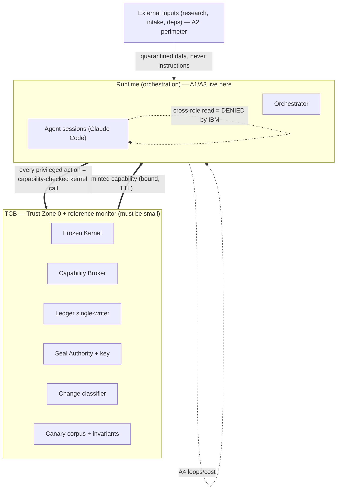

# PAEOS-7.5 — Runtime Threat Model

| | |
|---|---|
| **Artifact** | PAEOS-7.5 — Runtime Threat Model |
| **Position** | Adversarial companion to PAEOS-7 (Runtime Architecture). Sibling to PAEOS-6 (Hidden Assumptions), applied to the *executable* layer. |
| **Status** | Draft for adversarial ratification. **Some findings propose amendments to PAEOS-7 — see §8.** |
| **Thesis** | PAEOS-6 attacked the constitution's assumptions. **PAEOS-7.5 attacks the runtime's assumptions — the places where a *correct* constitution becomes vulnerable the moment it starts executing.** A safe constitution running on an unsafe runtime is unsafe. |
| **Prime directive inherited** | Correctness over cost. A control may be expensive; it may not be absent. |

> **How to read:** §3 defines what must be protected (the TCB) and why the kernel must stay small. §5 lists invariants that must never break. §6 is the threat catalog (the core). §8 is the payoff: the concrete design changes this pass forces back into PAEOS-7. §9 is honest about this model's own blind spots.

## Table of contents
- [1. Method & scope](#1-method--scope)
- [2. Threat actors](#2-threat-actors)
- [3. Trusted Computing Base & the small-kernel thesis](#3-trusted-computing-base--the-small-kernel-thesis)
- [4. Trust boundaries](#4-trust-boundaries)
- [5. Security invariants](#5-security-invariants-must-always-hold)
- [6. Threat catalog](#6-threat-catalog)
- [7. Detection & response](#7-detection--response)
- [8. Design changes forced by this threat model](#8-design-changes-forced-by-this-threat-model-amendments-to-paeos-7)
- [9. This model's own hidden assumptions](#9-this-models-own-hidden-assumptions)

---

## 1. Method & scope

A threat is credible in this model if it lets an adversary achieve any of: **(a)** advance a defective goal to `SEAL`; **(b)** change the frozen kernel or a safety control without the FR-2 amendment path; **(c)** read or corrupt another role's context (defeating FR-3 independence); **(d)** make the system spend unbounded resources or loop without progress; **(e)** poison future decisions via memory.

**In scope:** everything from `INTAKE` to `RESTART`, plus the self-improvement loops. **Out of scope (assumed, flagged in §9):** the integrity of the host OS, the honesty of the human ratifier, and the correctness of the frozen-kernel *text* itself (that is PAEOS-6's job; here we assume the text is right and ask whether the runtime *honors* it).

Each threat is rated **Impact** (Critical/High/Med) × **Likelihood** (High/Med/Low). Likelihood assumes a capable adversary and current controls.

## 2. Threat actors

| Actor | Capability | Motive |
|-------|-----------|--------|
| **A1 — Compromised/misaligned internal agent** | Full capability of its assigned role; can produce any artifact/evidence within its scope; can reason about the system. | Advance defective work, escalate privilege, weaken controls. The primary actor. |
| **A2 — External injector** | Controls content the system ingests (research results, intake payloads, external evidence, dependency sources). | Prompt-inject to hijack an agent's control flow; smuggle instructions as data. |
| **A3 — Goodharting agent (no malice)** | A well-aligned agent optimizing the *measured* gate rather than its *intent*. | Not adversarial, but produces the same failure: evidence that passes the letter of a gate. Often the *most likely* actor. |
| **A4 — Emergent dynamics (no actor)** | None — arises from feedback loops, retries, recursion, concurrency. | Livelock, cost spiral, oscillation. A threat with no attacker. |
| **A5 — Insider with kernel access** | Can change the TCB directly. | Out of technical scope; mitigated only by keeping the TCB small + auditable + amendment-gated (§3). |

## 3. Trusted Computing Base & the small-kernel thesis

Everything in PAEOS's safety rests on a small set of components being correct. If any TCB component is wrong or subverted, **no downstream control can save the system.** The TCB is exactly:

| TCB component | Why it is trusted | Consequence if wrong |
|---------------|-------------------|----------------------|
| **Frozen Kernel + reference monitor** (PAEOS-7 §3.2) | It decides every legal transition and mints every capability. | Total compromise. |
| **Capability / permission broker** | It is the *only* thing standing between a role and privilege it shouldn't have. | Universal privilege escalation. |
| **Ledger single-writer + hash-chain** | It is the source of truth; audit and replay depend on it. | Undetectable history rewrite. |
| **Seal Authority + its signing key** | It is the only thing that makes an artifact canonical. | Forged canon. |
| **Change classifier (soft vs hard)** | It decides what needs human ratification (see T4). | Silent unsafe self-modification. |
| **Canary corpus + this threat model + classification rules** | They are the system's alarms. | The system can disable its own alarms. |

> **The small-kernel thesis (this is why PAEOS-7's kernel must be small — restated as a *security* argument, not an aesthetic one):** the TCB is the attack surface that *cannot* be defended by any other layer. Its safety is achieved only by **minimization + auditability + amendment-gating**, never by runtime checks. Therefore the kernel must be small enough to be *fully human-audited and formally reasoned about* — the ~20k-LOC ceiling is a **security budget on the trusted computing base**, not a code-golf target. Every line added to the kernel is a line added to the set of things that must be proven correct. **Consequence (amendment A-1, §8): the canary corpus, this threat model's invariants, and the soft/hard classification rules MUST live in Trust Zone 0 (immutable), because they are TCB and an agent that can edit its own alarms is already past every other control.**

## 4. Trust boundaries

The threats live at the crossings. Everything inside a box trusts itself; nothing across a boundary is trusted without a capability + validation.



## 5. Security invariants (must always hold)

These are checkable predicates. A build that can violate one is rejected. They are the operational form of the FRs.

1. **SI-1 (No ambient authority).** No component acts on privilege it wasn't explicitly granted for this (session, goal, stage, role). Deny-by-default. *(FR-1, MR)*
2. **SI-2 (No self-advancement).** No agent can commit a transition on its own goal; only the kernel commits, only on validated evidence. *(FR-4)*
3. **SI-3 (Separation of powers).** For one goal/run, no session holds two of {build, verify, adversary, seal}. Role binding is immutable per (session, goal). *(MR, FR-3)*
4. **SI-4 (Evidence binding).** Evidence is valid only against the exact `artifact_hash` + `environment_hash` it was produced for; stale evidence cannot be replayed against a changed artifact. *(FR-4)*
5. **SI-5 (Barrier integrity).** The adversary receives only the IBM-sealed bundle; builder scratch/reasoning never crosses; adversary findings never cross back pre-verdict. *(FR-3)*
6. **SI-6 (Ledger monotonicity).** The ledger is append-only; the chain verifies from an anchored head; no fork. *(FR-5)*
7. **SI-7 (Seal immutability).** A sealed artifact is never mutated; defects are superseded, never edited. *(FR-7)*
8. **SI-8 (No autonomous TCB change).** No autonomous path modifies Z0 / the TCB; all such changes go through the hard loop with human sign-off. *(FR-2)*
9. **SI-9 (Progress or halt).** Every loop makes monotonic progress or halts; nothing runs unbounded. *(new — see T5)*
10. **SI-10 (Bounded spend).** Total spend is bounded at both per-goal and global scope; overflow halts, never spirals. *(new — see T6)*

## 6. Threat catalog

### T1 — Agent privilege escalation · Impact: Critical · Likelihood: Med

| | |
|---|---|
| **Attack surface** | Capability broker, MCP allow-lists, reference monitor, the doc agent (widest read scope). |
| **Scenarios** | (a) request capabilities beyond role; (b) **confused deputy** — trick a higher-privileged component (doc agent, kernel) into acting for the attacker; (c) **stale token reuse** after stage close; (d) **role relabeling** — reuse a builder session as verifier for the same goal (SI-3 break); (e) an MCP server exposes a method not gated by role. |
| **Existing control (PAEOS-7)** | Deny-by-default, reference monitor, per-session/goal/stage grants, separation of powers. |
| **Residual gap** | Doc agent's broad read scope is a cross-role channel (SI-5 risk); capability TTL/binding not specified; role binding mutability not stated; the kernel trusts agent-supplied inputs. |
| **Required hardening** | Capabilities are **unforgeable tokens bound to (session, goal, stage, role) with short TTL** and an explicit operation allow-list (§7.6 contract). **Role binding is immutable per (session, goal)** — no relabeling (enforces SI-3). The **doc agent is barrier-scoped too** — read access is per-goal and write is draft-only; it is never a channel between roles. **All agent outputs are treated as hostile input to the kernel** (validate before dispatch). |

### T2 — Evidence forgery · Impact: Critical · Likelihood: High

**The single most important threat: the entire system gates on evidence (FR-4). If evidence is forgeable, every gate is theater.** A3 (Goodhart) makes this *likely*, not just possible.

```
GOAL: seal a defective artifact
  OR── fabricate a passing test-result artifact
  OR── write tests that trivially pass (Goodhart / A3)          [most likely]
  OR── replay STALE evidence from a prior passing artifact
  OR── collude: builder produces evidence, colluding verifier signs
  OR── submit non-reproducible evidence (a benchmark no one can re-run)
  OR── forge the signature (agent holds a signing key)
```

| | |
|---|---|
| **Existing control** | Content-addressed evidence; kernel re-runs deterministic checks; adversary may attack evidence; evidence signed. |
| **Residual gap** | Judgment-based evidence can't be kernel-re-run; stale-evidence replay not explicitly blocked; reproducibility not *enforced*; agents holding signing keys = forgery vector. |
| **Required hardening** | **(1) Binding:** evidence carries `(artifact_hash, claim_id, environment_hash, reproducible_command)`; a gate rejects evidence whose `artifact_hash` ≠ the artifact under review (kills stale replay, SI-4). **(2) Deterministic evidence is *always* kernel-reproduced** at G-Court — not sampled. **(3) Non-deterministic evidence requires two independent producers** (builder-side + court-side) agreeing within declared tolerance. **(4) Signing keys are held by the kernel, not agents** — an agent *requests attestation*; the kernel verifies, then signs (removes key compromise as a forgery vector). **(5) Court prefers adversarially-generated + mutation tests** (already in PAEOS-7 §4.3) to blunt A3. |

### T3 — Memory poisoning · Impact: High · Likelihood: Med

| | |
|---|---|
| **Attack surface** | Scar store, precedent store, scar detection-signatures, scar retrieval (esp. semantic retrieval in Phase 3). |
| **Scenarios** | (a) inject a **false scar with a broad signature** → blocks legitimate backlog (DoS) or steers designs toward an attacker pattern; (b) scar whose **guard-action weakens a control**; (c) **erode** a real scar so its signature stops matching; (d) **precedent poisoning** to justify a bad decision; (e) **retrieval poisoning** — craft artifacts to manipulate embedding-based retrieval. |
| **Existing control** | Scar writes serialize through kernel; no agent may delete a scar; scars written post-retrospective (stage 17). |
| **Residual gap** | Retrospective agent could author a poisoned scar; a scar's guard-action could itself be a de-facto control change; broad-signature DoS unaddressed; semantic retrieval is manipulable. |
| **Required hardening** | **Scar creation is itself an evidence-gated transition** requiring a root-cause bundle; a scar **may not declare a guard-action that modifies a gate/kernel** (those route to the amendment path). Scars are **append-only + signed with run provenance**. A scar whose signature **matches > θ of the active backlog is quarantined for human review** (kills backlog-DoS). **Retrieval is signature-match-first (deterministic); semantic is augmentation only, never sole authority.** Erosion is detectable because scars are never deleted — a signature that stops matching is a ledgered change. |

### T4 — Unsafe self-modification · Impact: Critical · Likelihood: Med

**The scariest threat: the system's purpose (stage 18) is to change itself.** The attack is to get it to weaken its own safety controls — ideally *without tripping the human gate*.

```
GOAL: weaken a safety control autonomously
  OR── write Z0 directly                         → blocked by SI-8 (unwritable)
  OR── MISCLASSIFY a hard change as "soft"        → THE REAL ATTACK
  │       e.g. a "skill update" that actually changes verification behavior
  OR── deceive the ratifier: craft the diff so risk is under-appreciated
  OR── boiling-frog: many "safe" soft changes that COMPOUND into weakening
  OR── disable the alarms: rewrite the canary corpus / threat model / classifier
```

| | |
|---|---|
| **Existing control** | Z0 unwritable to agents; hard loop = self-hosted lifecycle + adversarial ratification of the invariant diff + human sign-off; soft/hard split. |
| **Residual gap** | **The soft/hard classification is the weak point** — if an agent classifies its own change, it can route around the human gate (T4b). Ratifier deception (T4c). Cumulative drift (T4d). The alarms themselves are mutable unless placed in the TCB (T4e). |
| **Required hardening** | **(1) Classification is a KERNEL function, not an agent decision, and is conservative:** any change that *can* affect verification / gate / isolation / budget / memory-guard behavior — determined by **static analysis of blast radius, not the agent's claim** — is **hard**. **(2) Canary corpus, threat-model invariants, and classification rules live in Z0** (amendment A-1). **(3) The safety-invariant diff shown to the ratifier is generated by the kernel (neutral), never by the proposing agent** (kills T4c). **(4) Cumulative-drift metric:** the sum of all soft changes since the last kernel seal is tracked against a frozen baseline; **drift past a threshold forces a hard-loop review even if each step was individually soft** (kills boiling-frog, T4d). |

### T5 — Infinite / non-progressing loops · Impact: High · Likelihood: Med (A4)

| | |
|---|---|
| **Scenarios** | (a) **remand livelock** (court→rebuild→court forever); (b) **meta-recursion** — improvement proposals that propose improvements to the proposal system, no base case; (c) **mutual remand** between two goals; (d) **self-hosting recursion** — a run re-deriving PAEOS-7 spawns a run that re-derives PAEOS-7…; (e) **oscillation** — change A and its reversal alternate forever. |
| **Existing control** | Budgets + backpressure halt. |
| **Residual gap** | A budget bounds *cost*, not *progress* — you can spend a bounded budget making zero progress, then halt, then repeat. Need **progress guarantees** (SI-9). |
| **Required hardening** | **Every loop declares a monotonic progress measure and a hard iteration cap.** Remands are capped (N remands → escalate to redesign or reject, never infinite retry). **Meta-proposals require the hard loop and a fixed recursion depth.** **Self-hosting has a base case: an idempotent re-derivation that produces no delta from the sealed version is a fixpoint and terminates.** **Oscillation detection:** a change that reverts one sealed within the last K runs is flagged as churn → human review. |

### T6 — Runaway compute cost · Impact: High · Likelihood: High

| | |
|---|---|
| **Scenarios** | (a) craft goals/artifacts that **maximize spend** (adversarial verbosity); (b) **triage-inflation DoS** — make trivial work look kernel-touching to force full adversarial re-derivation (the *most expensive* path); (c) cost amplification via loops (⊃ T5); (d) force many **adversary invocations** (the costliest role); (e) **retry storms** on a flaky non-deterministic check. |
| **Existing control** | Triage cost-gate, per-goal budgets, backpressure, model tiering. |
| **Residual gap** | Per-goal budget doesn't stop a **swarm of cheap goals** exhausting the org budget; triage class is forceable *upward* (T6b); adversary invocation count uncapped; retry policy unspecified. |
| **Required hardening** | **Two-tier budgets: per-goal AND global (org) with backpressure at both; global admission control sheds/queues new goals under pressure.** **Triage weight-class is evidence-based and appealable-down but not agent-forceable-up.** **Adversary invocations are capped per goal.** **Retry caps with exponential backoff** on non-deterministic checks. **Cost is a first-class ledgered metric with anomaly detection** — a goal > Nσ over its class median auto-halts for review (SI-10). |

### T7 — Ledger / persistence integrity · Impact: Critical · Likelihood: Low

| | |
|---|---|
| **Scenarios** | (a) tamper a past entry (chain defeats it *only if the head is trusted*); (b) **fork** the ledger (two valid chains); (c) **projection poisoning** — corrupt a materialized view so a gate reads wrong state before rebuild; (d) **CAS deletion** — GC removes still-referenced evidence. |
| **Existing control** | Append-only, hash-chained, single-writer. |
| **Required hardening** | **Anchor the chain head** (external append-only attestation) so tamper is detectable, not just chain-internal. **Single-writer identity is a kernel key** (no impersonation → no fork). **Projections are verified against the ledger hash before use in any gate decision.** **CAS GC is referential-integrity-safe** — referenced content is never collected (SI-6, SI-7). |

### T8 — Adjudicator subversion (court/adversary) · Impact: Critical · Likelihood: Med

| | |
|---|---|
| **Scenarios** | Compromised **adversary** sandbags (lets bad work through); compromised **court** passes bad work; the ultimate case — a compromised **kernel** defeats everything. |
| **Existing control** | Canaries; separation of powers; kernel is root of trust. |
| **Required hardening** | Canaries **must be in Z0** (A-1) or the subverted role rewrites them (⊃ T4e). A **missed canary quarantines that role's config** (PAEOS-7 §5.3). The kernel's integrity is the **irreducible root assumption** — mitigated *only* by the small-kernel thesis (§3): a TCB small enough to audit. This is why the kernel must be small. |

### T9 — Input-channel / prompt injection · Impact: High · Likelihood: High (A2)

| | |
|---|---|
| **Scenarios** | Stage-4 research or external evidence carries **instructions disguised as data** that hijack a downstream agent; a malicious dependency; an intake payload that steers triage. |
| **Existing control** | External content is quarantined data, never instructions; kernel mediates. |
| **Required hardening** | **Content/instruction separation is enforced, not assumed** — ingested content is provenance-tagged, wrapped as untrusted data, and downstream agents are constrained so external text cannot become control flow. Research outputs must be **re-verified/re-derived**, never trusted (FR-8 already forces this). |

## 7. Detection & response

- **Canaries** (known-bad artifacts) probe the court and adversary continuously; a miss → **quarantine that role config** (T8, T4e).
- **Anomaly detection** on cost, remand count, drift metric, and scar-signature breadth → auto-halt for human review (T3, T4d, T5, T6).
- **Quarantine** is the universal safe state (PAEOS-7 §4.4): kernel-integrity failure, broken chain, escalation attempt, missed canary, or budget/drift breach freezes state and requires a human. **Fail closed, never open.**
- **Every incident writes a scar** (FR-6) so the class is caught next time — the threat model feeds the memory it protects.

## 8. Design changes forced by this threat model (amendments to PAEOS-7)

This is the payoff — the runtime assumptions this pass broke, and the fixes now proposed as amendments to PAEOS-7. Each should be ratified and folded into the architecture (marked `[Δ7.5]` there).

| ID | Amendment | Kills | Touches TCB? → loop |
|----|-----------|-------|---------------------|
| **A-1** | Canary corpus, threat-model invariants, and soft/hard classification rules move to **Trust Zone 0 (immutable)**. | T4e, T8 | Yes → hard loop |
| **A-2** | **Change classification is a kernel function** based on **static blast-radius analysis**, not the agent's claim; conservative default = hard. | T4b | Yes → hard loop |
| **A-3** | **Cumulative-drift metric** vs. a frozen baseline; drift threshold forces a hard-loop review. | T4d | Yes → hard loop |
| **A-4** | **Evidence binding** to `(artifact_hash, environment_hash, reproducible_command)`; stale evidence rejected at gate. | T2 | No → soft (but gate behavior → hard) |
| **A-5** | **Signing keys held by kernel**, not agents; agents request attestation. | T2 | Yes → hard loop |
| **A-6** | **Capabilities are unforgeable, bound to (session, goal, stage, role), TTL'd**; role binding immutable per (session, goal). | T1 | Yes → hard loop |
| **A-7** | **Two-tier budgets (per-goal + global) with admission control**; triage class not agent-forceable-upward. | T6 | No → soft |
| **A-8** | **SI-9 progress guarantees**: every loop has a monotonic measure + hard cap; self-hosting has an idempotent-fixpoint base case; oscillation/churn detection. | T5 | Partly → hard for loop-governor |
| **A-9** | **Ledger head anchored externally**; projections verified against ledger hash before gate use; referential-integrity-safe GC. | T7 | Yes → hard loop |
| **A-10** | **Scar creation is evidence-gated**; a scar may not declare a gate/kernel-modifying guard-action; broad-signature scars quarantined. | T3 | No → soft (guard-action limits → hard) |

**Note the recursion:** most of these amendments touch the TCB, so — by A-2 — they themselves require the **hard loop** (self-hosted lifecycle + adversarial ratification + human sign-off). PAEOS-7.5 is thus the first real test of the amendment path: *the threat model's own fixes must survive the process the threat model hardened.*

## 9. This model's own hidden assumptions

Mirroring PAEOS-6, this threat model is not exempt from attack. Its load-bearing assumptions:

1. **The kernel is correct.** Everything reduces to this. Mitigated only by minimization + audit (§3), never eliminated. If the kernel is wrong, PAEOS-7.5 is wallpaper.
2. **The human ratifier is honest and competent.** A-2/A-3 route risk *to* the human, but a deceived, coerced, or overloaded ratifier is out of technical scope. FR-2's human gate is a trust anchor, not a proof.
3. **Static blast-radius analysis (A-2) is sound.** If a change can affect a control through a path the analysis misses, a hard change is misclassified as soft. The analysis is itself TCB and must be conservative and audited.
4. **Canaries are representative.** They raise the cost of sandbagging but cannot prove its absence; a novel defect class no canary models slips through until it becomes a scar.
5. **Model diversity for the adversary is available.** If only one capable model exists, adversary independence weakens to context/skill/evidence isolation (carried from PAEOS-7 §10).
6. **This list is incomplete.** By construction. The correct response to a threat this model missed is a new scar and a PAEOS-7.5 revision — not surprise.
