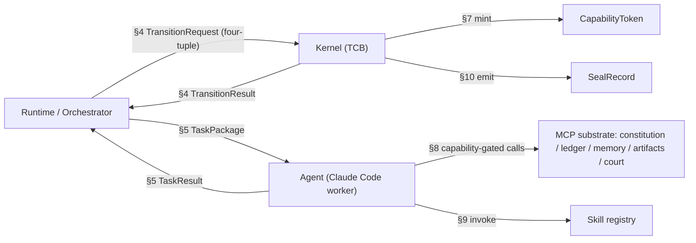

# PAEOS-7.6 — Runtime Interface Contracts

| | |
|---|---|
| **Artifact** | PAEOS-7.6 — Runtime Interface Contracts |
| **Position** | Implementation-enabling companion to PAEOS-7 (Runtime Architecture) and PAEOS-7.5 (Threat Model). |
| **Status** | Draft. Contracts are **normative shape**, not implementation. Builder agents derive `PAEOS-8` packages from these. |
| **Purpose** | Define the contracts at every trust boundary precisely enough that **Kernel, Runtime, Agents, and Substrate can be built independently and still compose**. This is where "Claude Code is a worker, not the brain" becomes a concrete wire format. |
| **Normativity** | A conforming implementation MUST satisfy every contract invariant in §11. The notation below is language-neutral typed pseudo-schema; the reference implementation is Python (per PAEOS-7 §3.9 module layout), but the *contracts* bind any implementation. |

> **Reading:** §2 is the map. §3 core types. §4 is the heart — the **four-tuple transition contract** (Goal + Evidence + Authority + Validation) that every state change obeys. §5 is the **task package** (the worker contract that dispatches Claude Code). §6–§10 are the supporting contracts. §11 lists the invariants a conforming build must not violate.

## Table of contents
- [1. Notation](#1-notation)
- [2. Contract map](#2-contract-map)
- [3. Core types](#3-core-types)
- [4. Kernel API — the four-tuple transition contract](#4-kernel-api--the-four-tuple-transition-contract)
- [5. Task package — the worker (agent) contract](#5-task-package--the-worker-agent-contract)
- [6. Evidence contract](#6-evidence-contract)
- [7. Capability token contract](#7-capability-token-contract)
- [8. MCP substrate contracts](#8-mcp-substrate-contracts)
- [9. Skill invocation contract](#9-skill-invocation-contract)
- [10. Seal record contract](#10-seal-record-contract)
- [11. Contract invariants & versioning](#11-contract-invariants--versioning)

---

## 1. Notation

- `Type { field: T }` — a record. `T?` optional. `T[]` list. `A | B` union. `enum{...}` closed set.
- `Hash` = content address (e.g. sha256 hex). `Sig` = kernel-produced signature. `Ts` = logical sequence number, **never wall-clock** (PAEOS-7 §3.5).
- **All hashes are of canonicalized content.** Two equal contents ⇒ one hash ⇒ one CAS entry.
- A contract marked **[kernel-only]** may be invoked only by the kernel; **[capability-gated]** requires a valid `CapabilityToken`.

## 2. Contract map

Four boundaries, each with a contract. This is the "hosts intelligence, does not contain it" boundary made explicit: the Runtime dispatches **task packages**; the Agent returns **task results**; neither can bypass the Kernel's four-tuple check.



## 3. Core types

```
GoalId       = string            // stable identity, immutable
RunId        = string            // one lifecycle execution of a goal
StageId      = enum{ RAW, RE_DERIVE, INTAKE, TRIAGE, IDEATE, RESEARCH,
                     TRADEOFF, MITIGATION, DESIGN, CRITIQUE, PLAN, IMPLEMENT,
                     VERIFY, ADVERSARIAL_REVIEW, LEDGER_SYNC, SEAL,
                     RETROSPECT, EVOLVE, MEMORY_UPDATE, IMPROVE_RUNTIME, RESTART }
Role         = enum{ PLANNER, BUILDER, CRITIC, VERIFIER, ADVERSARY, DOC, RATIFIER }
WeightClass  = enum{ ROUTINE, SUBSTANTIAL, KERNEL_TOUCHING }   // set at TRIAGE
ArtifactRef  = { hash: Hash, type: string }
Outcome      = enum{ COMMITTED, REMAND, REJECT, QUARANTINE, ABORT }
```

`StageId` names are the canonical machine constants for PAEOS-7's numbered stages (0→19 + RAW). They are the single source of truth for state identity across Kernel, Runtime, ledger, and traces.

## 4. Kernel API — the four-tuple transition contract

**The central contract.** Every state change in PAEOS is a `TransitionRequest` carrying exactly four things — **Authority, Goal, Evidence, Validation**. Miss any one ⇒ no transition. This is FR-4 (deny-by-default, evidence-gated) reduced to a wire format.

```
TransitionRequest {
  authority:  CapabilityToken     // WHO/what is permitted to request this (§7)
  goal_id:    GoalId              // WHICH goal (+ run)
  run_id:     RunId
  from_state: StageId             // current
  to_state:   StageId             // requested next (must be a legal edge, PAEOS-7 §4.1)
  evidence:   EvidenceRef[]       // WHAT proves the gate's pass-criterion (§6)
  validation: ValidationClaim     // the assertion being made, to be checked
}

ValidationClaim {
  gate_id:      string            // e.g. "G-Court"
  claims:       Claim[]           // each claim maps to required evidence
  producer:     Role
  produced_against: Hash          // artifact_hash this claim is about (SI-4 binding)
}

Claim { id: string, statement: string, evidence_refs: Hash[] }

TransitionResult {
  outcome:    Outcome
  committed_seq: Ts?              // ledger seq if COMMITTED
  remand_to:  StageId?            // if REMAND
  reason:     string             // required for non-COMMITTED
  verdict_ref: Hash?             // the recorded adjudication
}
```

**Kernel operations** (the complete privileged surface — kept small on purpose, §11):

```
open_stage(authority, goal_id, run_id, stage) -> TaskPackage        // [kernel-only] mints package + capability
propose_transition(TransitionRequest)        -> TransitionResult    // [capability-gated] the four-tuple check
mint_capability(goal_id, run_id, stage, role)-> CapabilityToken     // [kernel-only]
request_attestation(authority, payload_hash) -> Sig                 // [capability-gated] kernel signs; agents never hold keys (A-5)
request_seal(authority, goal_id, run_id)     -> SealRecord          // [capability-gated] idempotent (§10)
record_event(authority, Event)               -> Ts                  // [capability-gated] single-writer append (SI-6)
classify_change(proposal_ref)                -> enum{SOFT, HARD}     // [kernel-only] static blast-radius (A-2)
```

**Kernel enforcement pseudocode (normative behavior of `propose_transition`):**

```
1. verify(authority): valid token, not expired, bound to (goal_id, run_id, from_state, producer role)  // SI-1, T1
2. assert edge(from_state -> to_state) is legal for this goal's WeightClass                              // PAEOS-7 §4.1
3. for each claim in validation.claims:
      assert claim has evidence; for deterministic evidence -> KERNEL RE-RUNS it (not the agent)         // T2, SI-2
      assert every evidence.produced_against == validation.produced_against == artifact-under-review     // SI-4 (kills stale replay)
4. assert separation-of-powers: producer role != any conflicting role already used this (goal, run)      // SI-3
5. if to_state touches TCB: require classify_change == HARD -> route to amendment path, refuse here       // SI-8, A-2
6. on pass: record_event(TransitionCommitted); return COMMITTED
   on fail: record_event(<failure>); return REMAND | REJECT | QUARANTINE                                  // fail closed
```

## 5. Task package — the worker (agent) contract

This formalizes "Claude Code is a worker, not the brain." The Kernel/Runtime hands an agent a **fully-scoped package**; the agent executes and returns a **result**. The agent has *no ambient authority* — everything it may touch is in the package's capability.

```
TaskPackage {
  task_id:      string
  goal_id:      GoalId
  run_id:       RunId
  stage:        StageId
  role:         Role
  objective:    string                 // natural-language task, e.g. "Implement validator per plan#hash"
  capability:   CapabilityToken        // AUTHORITY — the only privilege the agent has (§7)
  permissions: {
    write_scopes: string[]             // e.g. ["paeos/kernel/validator.py"]
    read_scopes:  string[]
    mcp_servers:  string[]             // allow-list, e.g. ["constitution","artifacts","memory:read"]
    skills:       SkillRef[]           // registry entries this task may invoke (§9)
  }
  forbidden:    string[]               // explicit denials, e.g. ["modify constitution/","modify schemas/"]
                                       //   (documentation of intent; ENFORCEMENT is by capability, not this list — T1)
  required_evidence: EvidenceObligation[]   // what MUST be produced to pass the gate (FR-4)
  context_refs: ArtifactRef[]          // injected: design, plan, and MATCHED SCARS (FR-6, always on the path)
  budget: { tokens: int, wallclock_s: int, retries: int }   // per-goal slice of the two-tier budget (A-7)
}

EvidenceObligation { claim_id: string, kind: EvidenceKind, acceptance: string }

TaskResult {
  task_id:   string
  status:    enum{ COMPLETE, FAILED, ABANDONED }
  artifacts: ArtifactRef[]      // written to CAS
  evidence:  EvidenceRef[]      // §6, bound to artifact + environment
  trace_ref: Hash              // full agent I/O transcript (immutable, for audit + self-improvement)
  cost:      { tokens: int, wallclock_s: int, model_ver: string, skill_vers: string[] }
}
```

**Worked example** (matches the reviewer's illustration, now a real contract):

```json
{
  "task_id": "t-4812", "goal_id": "g-validator", "run_id": "r-3", "stage": "IMPLEMENT", "role": "BUILDER",
  "objective": "Implement validator.py per plan c3f9…",
  "capability": "<token bound to (g-validator, r-3, IMPLEMENT, BUILDER), TTL 30m>",
  "permissions": {
    "write_scopes": ["paeos/kernel/validator.py"],
    "read_scopes":  ["paeos/kernel/","spec/PAEOS-7-runtime-architecture.md"],
    "mcp_servers":  ["constitution","artifacts","memory:read"],
    "skills":       ["testing@2.1","security-review@1.4"]
  },
  "forbidden": ["modify constitution/","modify schemas/","merge","seal"],
  "required_evidence": [
    {"claim_id":"builds","kind":"BUILD","acceptance":"exit 0"},
    {"claim_id":"unit","kind":"TEST","acceptance":"tests/pass_validator.json all green, reproducible"}
  ],
  "context_refs": [{"hash":"c3f9…","type":"plan"},{"hash":"9a1b…","type":"scar"}],
  "budget": {"tokens": 400000, "wallclock_s": 1800, "retries": 2}
}
```

The Builder writes only `validator.py`, runs local tests, returns artifacts + bound evidence. It **cannot** merge or seal — not because it was told not to, but because its capability lacks those operations (T1, SI-1).

## 6. Evidence contract

Evidence is the currency of every gate. Its binding fields are what make forgery hard (PAEOS-7.5 T2 / A-4).

```
Evidence {
  hash:              Hash            // content address; this IS its id
  kind:              EvidenceKind    // enum{ BUILD, TEST, BENCHMARK, PROOF, CITATION, TRACE, MUTATION, CANARY }
  claim_id:          string
  artifact_hash:     Hash            // BINDING: the exact artifact this evidence is about (SI-4)
  environment_hash:  Hash            // BINDING: toolchain/deps fingerprint (reproducibility)
  reproducible_command: string?      // how the kernel/court re-runs it; required for deterministic kinds
  producer:          { role: Role, session: string }
  determinism:       enum{ DETERMINISTIC, NONDETERMINISTIC }
  result:            any             // structured outcome
  attestation:       Sig             // kernel-produced (agents never sign — A-5)
}
```

**Gate rules (normative):** deterministic evidence is **re-run by the kernel** at adjudication; non-deterministic evidence requires **two independent producers within tolerance**; any evidence whose `artifact_hash` ≠ the artifact under review is **rejected** (stale-replay defense).

## 7. Capability token contract

The unforgeable authority object. This is the reference monitor's teeth (PAEOS-7.5 T1 / A-6).

```
CapabilityToken {
  token:        Sig                 // kernel-signed; unforgeable
  bound_to:     { goal_id, run_id, stage: StageId, role: Role, session: string }
  operations:   string[]            // explicit allow-list, e.g. ["cas:write:<scope>","mcp:memory:read","propose_transition"]
  issued_seq:   Ts
  expires_seq:  Ts                  // short TTL; stage-scoped
}
```

**Invariants:** minted only by the kernel; **bound_to is immutable** (no relabeling a BUILDER token into a VERIFIER — SI-3); expired/out-of-scope tokens are rejected; no operation outside `operations`; **no self-grant, no escalation.**

## 8. MCP substrate contracts

Each substrate capability is an MCP server; a task reaches it only if its `permissions.mcp_servers` allow-list (backed by the capability) includes it. Deny-by-default.

| Server | Methods (capability-gated) | Notes |
|--------|---------------------------|-------|
| **constitution** | `get_clause(id)`, `query(pattern)`, `lineage(hash)` | **Read-only always.** No write method exists (FR-1). Serves Z0. |
| **ledger** | `read(range)`, `verify_chain()` — **append is NOT exposed**; agents emit events only via kernel `record_event` | Single-writer preserved (SI-6, T7). |
| **memory** | `match_scars(signature)`, `get_precedent(id)`, `propose_scar(ScarDraft)` | `propose_scar` is a *gated transition*, not a direct write (T3/A-10). `:read` vs `:write` are separate grants. |
| **artifacts** | `put(content) -> Hash`, `get(Hash)` | CAS; content-addressed; immutable; referential-integrity GC (T7). |
| **court** | `submit_evidence(Evidence)`, `get_verdict(hash)` | Submission is inert until the kernel adjudicates (SI-2). |

## 9. Skill invocation contract

Skills are **capabilities the workflow invokes**, not the workflow itself (the reviewer's point, formalized). A stage's *method* is a skill; the lifecycle *invokes* it.

```
SkillRef  = { name: string, version: string }         // e.g. {name:"testing", version:"2.1"} → "testing@2.1"
invoke_skill(capability, SkillRef, input) -> SkillResult   // [capability-gated] only if SkillRef ∈ task.permissions.skills
SkillResult { output: any, skill_version: string }         // version recorded in the trace (drift audit)
```

**Invariants:** a task may invoke only skills in its package; the resolved `skill_version` is pinned per session and recorded in `TaskResult.cost.skill_vers`; changing a skill that alters a gate's *behavior* is classified **HARD** (A-2) and routes to amendment.

## 10. Seal record contract

The idempotent finalization (FR-7). Sealing the same content twice yields the same record, committed once.

```
SealRecord {
  seal_hash:     Hash              // = H(artifact_bundle_hash + verdict_ref + adversary_ref + ledger_head)
  goal_id:       GoalId
  run_id:        RunId
  artifact_bundle: Hash            // the sealed artifact(s)
  verdict_ref:   Hash              // passing G-Court verdict
  adversary_ref: Hash              // resolved G-Adversary review (no blocking dissent)
  ledger_head:   Ts                // chain position at seal
  attestation:   Sig               // kernel key (A-5)
  promote_to:    string?           // promotion target, if any
  supersedes:    Hash?             // prior seal this replaces (compensation, never mutation — PAEOS-7 §4.5)
}
```

**Invariants:** the kernel refuses `request_seal` without a passing verdict **and** a resolved adversary review **and** a verified ledger chain (G-Seal, PAEOS-7 §4.3); re-issuing is idempotent by `seal_hash`; a sealed artifact is immutable — defects produce a new seal with `supersedes`, never an edit (SI-7).

## 11. Contract invariants & versioning

A conforming implementation MUST hold all of these (they are the wire-level form of PAEOS-7.5 §5):

1. **Every kernel call carries a valid `CapabilityToken`;** there is no unauthenticated privileged path. *(SI-1)*
2. **Agents never write the ledger, never write Z0, never hold signing keys.** They emit via `record_event`, request attestation, and propose transitions. *(SI-2, SI-8, A-5)*
3. **Every transition is a complete four-tuple** (authority + goal + evidence + validation); partial requests are rejected. *(FR-4)*
4. **Evidence is bound** to `artifact_hash` + `environment_hash`; stale evidence cannot advance a changed artifact. *(SI-4)*
5. **Role binding is immutable** per (session, goal, run); separation of powers is checked on every transition. *(SI-3)*
6. **Deterministic evidence is kernel-reproduced**, not trusted. *(T2)*
7. **TCB-touching changes are kernel-classified HARD** and cannot be committed via `propose_transition`; they route to the amendment path. *(SI-8, A-2)*
8. **All failures fail closed** → REMAND / REJECT / QUARANTINE, never silent advance. *(PAEOS-7 §4.4)*

**Versioning.** Every contract in this document is a versioned artifact. A change to any contract **that the kernel enforces** (§4, §6, §7, §10, and the invariants) is TCB-touching ⇒ **hard loop** (self-hosted lifecycle + adversarial ratification + human sign-off). Contracts that only shape agent I/O (§5 objective/context, §9 skill I/O) may evolve via the soft loop. The kernel records the contract version in force for every run, so a replay reconstructs the exact rules that governed it.
