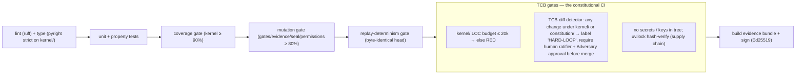
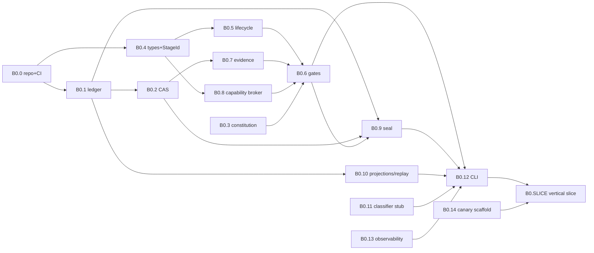
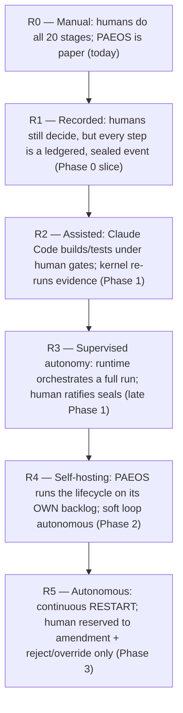

# PAEOS-8 — Runtime Implementation Playbook

| | |
|---|---|
| **Artifact** | PAEOS-8 — Runtime Implementation Playbook |
| **Position** | Executable successor to PAEOS-7 / 7.5 / 7.6. The last artifact before code exists. |
| **Status** | Draft for adversarial ratification. Once sealed, this is the standing order for the build. |
| **Type** | **Executable engineering plan — NOT a PRD.** Every task is dependency-ordered and has testable acceptance. |
| **Reader** | Claude Code / Opus / Sonnet build agents **and** the human ratifier. Agents execute tasks; they do **not** make architectural decisions — those are all resolved here or in 7/7.5/7.6. |
| **Prime rule for executing agents** | **If a task requires an architectural decision that is not written in PAEOS-7/7.5/7.6/8, STOP. That is a defect in this playbook, not license to improvise. Escalate to the human ratifier.** Improvising architecture is the #1 slop vector (§13). |

> **The one-line answer to "what do we build first tomorrow?":** the **append-only, hash-chained, single-writer Ledger** (`kernel/ledger.py`) with a `replay()` that reconstructs identical state, plus the repo/CI skeleton that guards the TCB. Nothing else in PAEOS can exist before the ledger, because the ledger *is* the source of truth (FR-5). Task **B0.1**. Everything today (**B0.0**) is the toolchain that lets B0.1 be verified. See §10 and §11.

## Table of contents
- [1. Repository structure](#1-repository-structure)
- [2. Module breakdown](#2-module-breakdown)
- [3. Technology decisions](#3-technology-decisions)
- [4. Development phases](#4-development-phases)
- [5. Agent assignments](#5-agent-assignments)
- [6. Testing strategy](#6-testing-strategy)
- [7. Verification strategy](#7-verification-strategy)
- [8. CI/CD strategy](#8-cicd-strategy)
- [9. Security model](#9-security-model)
- [10. Bootstrap sequence](#10-bootstrap-sequence-the-ordered-task-list)
- [11. First working vertical slice](#11-first-working-vertical-slice)
- [12. Migration path: manual PAEOS → autonomous runtime](#12-migration-path-manual-paeos--autonomous-runtime)
- [13. Adversarial review of this playbook](#13-adversarial-review-of-this-playbook)

---

## 1. Repository structure

One repository. The **TCB boundary is physical**: everything under `kernel/` is Trust Zone 0/1 and is CI-gated (§8); everything under `runtime/` is untrusted Z2. This layout is the executable form of PAEOS-7 §3.9.

```
paeos/
├── constitution/                 # Z0 — IMMUTABLE. The sealed constitutional layer.
│   ├── PAEOS-0..6.md             # copied, read-only; changed only by amendment.py
│   ├── canaries/                 # known-bad artifacts (7.5 A-1) — TCB, amend-only
│   └── classifier_rules/         # soft/hard blast-radius rules (7.5 A-1/A-2) — TCB
│
├── kernel/                        # TCB — Z0+Z1. Small, auditable, LOC-budgeted (§8 gate).
│   ├── __init__.py
│   ├── types.py                  # core types + StageId (7.6 §3)
│   ├── constitution.py           # read-only accessor over constitution/ (FR-1, FR-8)
│   ├── amendment.py              # the ONLY writer of constitution/ (§7.4 of PAEOS-7)
│   ├── ledger.py                 # append-only, hash-chained, single-writer (FR-5)
│   ├── cas.py                    # content-addressed store interface (FR-4/FR-7)
│   ├── lifecycle.py              # legal-edge table + chambers (7 §4.1)
│   ├── state_machine.py          # uniform stage sub-state engine (7 §4.2)
│   ├── gates.py                  # Gate & Evidence enforcement, deny-by-default (FR-4)
│   ├── evidence.py               # binding + kernel re-run (7.6 §6)
│   ├── permissions.py            # capability broker / reference monitor (MR)
│   ├── barrier.py                # Information-Barrier Manager (FR-3)
│   ├── seal.py                   # Seal Authority + Ed25519 attestation (FR-7, 7.5 A-5)
│   ├── classifier.py             # soft/hard classification, reads classifier_rules/ (7.5 A-2)
│   └── projections.py            # replay → materialized views (FR-5)
│
├── runtime/                       # Z2 — untrusted orchestration, least-privilege.
│   ├── orchestrator/
│   │   ├── lifecycle_runner.py   # drives kernel over the durable substrate
│   │   ├── agent_dispatcher.py   # builds TaskPackages, spawns Claude Code (7.6 §5)
│   │   └── task_scheduler.py     # per-goal + global budgets, backpressure (7.5 A-7)
│   ├── agents/                   # THIN harnesses. Intelligence = Claude Code + skills.
│   │   ├── planner.py builder.py critic.py verifier.py adversary.py doc.py
│   ├── court/                    # Verification Layer harness (7 §3.6)
│   ├── review/                   # Adversary harness, behind the barrier (7 §3.6)
│   ├── memory/
│   │   ├── artifact_store.py evidence_store.py scar_store.py precedent_store.py
│   └── integrations/
│       ├── claude_code.py mcp_client.py git.py durable_substrate.py
│
├── mcp/                           # MCP servers exposing the substrate (7.6 §8)
│   ├── constitution_server.py ledger_server.py memory_server.py
│   ├── artifacts_server.py court_server.py
│
├── skills/                        # versioned stage/role procedures (one dir per skill)
│   └── <skill-name>@<ver>/SKILL.md
│
├── cli/                           # human operator control plane (bootstrap surface)
│   └── paeos.py                  # create-goal, advance, ledger, replay, seal, inspect
│
├── ops/                           # local dev + deploy
│   ├── docker-compose.yml        # Postgres, etc.
│   └── keys/                     # gitignored; kernel signing keys live OUT of the repo
│
├── tests/                         # mirrors the tree; kernel tests are first-class
│   ├── kernel/ runtime/ mcp/ replay/ canary/ slice/
│
├── docs/                          # generated ledger of ADRs, retrospectives (Doc agent)
├── spec/                          # PAEOS-0..8 (this layer)
├── pyproject.toml                 # uv-managed; pinned + locked
├── uv.lock
└── .github/workflows/ci.yml       # §8 pipeline incl. TCB gates
```

---

## 2. Module breakdown

Each kernel module has a **LOC budget** (sum ≤ ~20k, the TCB security budget, 7.5 §3). Public interfaces are the contracts in **PAEOS-7.6** — build to those signatures; do not invent new ones.

| Module | Responsibility (one sentence) | Contract (7.6) | Phase | Kernel LOC budget |
|--------|-------------------------------|----------------|-------|-------------------|
| `kernel/types.py` | Core types + `StageId`, `GoalId`, refs. | §3 | 0 | 300 |
| `kernel/ledger.py` | Append-only, hash-chained, single-writer log; `append`, `read`, `verify_chain`. | §8 ledger | 0 | 800 |
| `kernel/cas.py` | Put/get immutable content by hash; referential-integrity-safe GC. | §8 artifacts | 0 | 500 |
| `kernel/constitution.py` | Read-only `get_clause/query/lineage` over `constitution/`. | §8 constitution | 0 | 400 |
| `kernel/lifecycle.py` | Legal-edge table (7 §4.1); `is_legal(from,to,class)`. | §4 | 0 | 500 |
| `kernel/state_machine.py` | Stage sub-state transitions (7 §4.2). | §4 | 0 | 400 |
| `kernel/evidence.py` | Evidence binding `(artifact_hash, env_hash)`; kernel re-run of deterministic evidence. | §6 | 0 | 900 |
| `kernel/gates.py` | The four-tuple check; deny-by-default; failure routing. | §4 | 0 | 1200 |
| `kernel/permissions.py` | Mint/verify capability tokens; reference monitor; separation-of-powers check. | §7 | 0 | 900 |
| `kernel/seal.py` | Idempotent Ed25519 seal; commit to ledger. | §10 | 0 | 700 |
| `kernel/projections.py` | Replay ledger → goal/state views; verify-against-head. | §4 | 0 | 600 |
| `kernel/barrier.py` | Build the IBM sealed-evidence bundle; enforce cross-role read denial. | (7 §3.2) | 1 | 700 |
| `kernel/classifier.py` | Static blast-radius soft/hard classification from `classifier_rules/`. | (7.5 A-2) | 1→2 | 900 |
| `kernel/amendment.py` | The sole Z0 writer; hard-loop transaction. | (7 §7.4) | 2 | 600 |

`runtime/*` and `mcp/*` modules have **no LOC budget** (untrusted, allowed to be large). Their interfaces are still the 7.6 contracts.

---

## 3. Technology decisions

**All decisions needed for Phase 0/1 are LOCKED here** so no agent has to choose. Deferred items are explicitly deferred with a revisit trigger (do not implement early — that is scope-creep slop, §13).

| Concern | Decision (LOCKED unless noted) | Rationale | Revisit trigger |
|---------|-------------------------------|-----------|-----------------|
| Language | **Python 3.12+** | Matches 7.6 module trees; strongest agent-tooling + Claude Code ergonomics. | Never for kernel; a hot path may add a native ext. |
| Dependency mgmt | **uv** + committed `uv.lock` | Fast, reproducible, hash-locked (supply-chain, §9). | — |
| Lint / format | **ruff** | Single fast tool. | — |
| Types | **pyright (strict)** on `kernel/`; basic on `runtime/` | Kernel is TCB → strict. | — |
| Persistence | **PostgreSQL 16** (ledger + projections + metadata) | ACID single-writer append is exactly FR-5; battle-tested. | Multi-writer/scale → partition or event-store. |
| Durable execution (Phase 0/1) | **Event-sourced Postgres loop in `lifecycle_runner.py`** — **NOT Temporal yet** | MVP needs resumability, not distributed scheduling; Temporal is premature ops burden. Replay from ledger gives crash-safety. | **Phase 2/3** concurrency/HA → adopt **Temporal** behind `durable_substrate.py` (interface already isolates it). |
| CAS backend | **Filesystem (sha256 fan-out) + Postgres metadata** | Simplest correct CAS; interface hides it. | Scale/multi-node → S3-compatible. |
| Signing | **Ed25519 via `pynacl`**, keys **kernel-held, outside repo** (`ops/keys/`, gitignored) | 7.5 A-5: agents never hold keys. | HSM/KMS at Phase 3. |
| Agent runtime | **Claude Code sessions** spawned as subprocesses with scoped workspace + MCP allow-list, via `integrations/claude_code.py` | 7's chosen agent runtime; enforces sandbox + permissions. | — |
| Substrate access | **MCP servers over stdio**, one per substrate, capability-scoped per session | 7.6 §8. | Remote transport at scale. |
| Model tiering | **Opus** = design/architecture/adversary/classifier-review; **Sonnet** = build/test/doc/triage | 7 §9.4 cost tiering + §5 here. | Model landscape shifts. |
| Control plane | **CLI (`cli/paeos.py`)** for Phase 0; add **FastAPI** read API in Phase 1 | Bootstrap needs an operator surface day one. | Web console at Phase 3 (7 §8 P3.5). |
| Testing | **pytest** + **hypothesis** (property) + **mutmut** (mutation, for gate/evidence/seal) | Court needs mutation tests; kernel needs property tests. | — |
| CI | **GitHub Actions** | Standard; supports the TCB gates. | — |
| Observability | **structlog** (JSON logs) + a **cost/trace meter** in `runtime` writing to Postgres | Missing from PAEOS-7; required (§13). | OpenTelemetry at Phase 2. |
| Ledger anchoring (7.5 A-9) | **Deferred to Phase 2** (in-DB hash-chain only for P0/1) | External anchor is scale-hardening, not MVP-correctness. | Phase 2. |
| Concurrency / multi-goal | **Deferred to Phase 3** (single goal at a time in P0/1) | Isolation correctness before throughput. | Phase 3. |

---

## 4. Development phases

Build phases map 1:1 to PAEOS-7 §8. Each has a **milestone gate** (exit criteria) that is itself an evidence-gated event on the ledger — the build eats its own dog food from Phase 0.

| Phase | Milestone (exit criteria — all must be ledgered + sealed) | Corresponds to |
|-------|-----------------------------------------------------------|----------------|
| **Phase 0 — Foundation** | The **vertical slice (§11)** passes: a goal walks `INTAKE→IMPLEMENT→VERIFY→SEAL` with real evidence the kernel re-runs, a signed seal, and a replay that reproduces identical state. Humans play all agents. CI TCB gates live. | 7 §8 Phase 0 |
| **Phase 1 — MVP runtime** | One **autonomous** end-to-end run: Claude Code agents (Planner/Builder/Verifier/Adversary) take an intake to a sealed, court-passed, adversary-reviewed change, behind real information barriers, with scars written. Triage fast/full path works. | 7 §8 Phase 1 |
| **Phase 2 — Self-hosting** | PAEOS accepts **its own** next task from `spec/` backlog and runs the lifecycle on it; soft-loop scar/skill updates live; amendment path wired + human-gated; canary calibration running. | 7 §8 Phase 2 |
| **Phase 3 — Autonomous loop** | Continuous `RESTART` scheduling, multi-goal concurrency + isolation, economic governor, distributed ledger, human reserved to amendment + reject/override. | 7 §8 Phase 3 |

**Rule:** no Phase N+1 task starts until the Phase N milestone is sealed. Building ahead is scope-creep (§13).

---

## 5. Agent assignments

During bootstrap the runtime does not exist, so **humans + Claude Code agents build it manually — but under the same separation of powers the runtime will enforce** (MR). This makes the bootstrap constitutionally consistent and trains the exact roles Phase 1 will automate.

| Build-time agent | Model | Activates | May do | May **not** do (enforced by workspace/branch scoping + review) |
|------------------|-------|-----------|--------|----------------------------------------------------------------|
| **Architect** | Opus | Any spec ambiguity; cross-module contracts | Escalate ambiguities to human; author/adjust 7.6 contracts (as amendments) | Write module implementation code; resolve ambiguity by improvising |
| **Builder** | Sonnet | A task with a resolved contract | Implement one module/task on its own branch; write local tests | Merge; verify its own module; touch `kernel/` without a hard-loop PR; edit `constitution/` |
| **Verifier** | Sonnet (separate session) | After a Builder marks a task done | Write/run the independent test suite; reproduce the builder's evidence; render pass/fail | Modify the code under review; be the same session that built it |
| **Adversary** | Opus (isolated session) | Before any `kernel/` module is build-sealed | Attack the module against PAEOS-7.5 threats; file blocking findings | See the builder's chat/reasoning; propose fixes (independence, FR-3) |
| **Doc** | Sonnet | On every sealed task | Write the ADR + ledger entry + update `docs/` | Make engineering decisions; alter verdicts |
| **Human ratifier** | — | TCB seals, ambiguities, key custody, phase gates | The only authority listed in §9/§13 | Delegate the sign-off (FR-2) |

**Separation-of-powers rule for the build:** for any one module, `Builder ≠ Verifier ≠ Adversary` (distinct sessions/contexts). A kernel module is not build-sealed until Verifier passes **and** Adversary finds nothing blocking **and** (because `kernel/` is TCB) the human ratifier signs. This is the manual enactment of G-Court + G-Adversary + G-Seal.

---

## 6. Testing strategy

| Layer | What | Tooling | Bar (CI-enforced) |
|-------|------|---------|-------------------|
| **Unit** | Every kernel function; pure where possible. | pytest | `kernel/` line + branch coverage ≥ **90%**. |
| **Property** | Invariants: ledger append never mutates; replay is deterministic; a token never grants an out-of-scope op; seal is idempotent. | hypothesis | The 8 invariants of 7.6 §11 each have ≥1 property test. |
| **Mutation** | The security-critical trio: `gates.py`, `evidence.py`, `seal.py`, `permissions.py`. | mutmut | Mutation score ≥ **80%** on these four; a surviving mutant on a gate check fails CI. |
| **Replay/determinism** | Replaying a recorded N-event log reproduces byte-identical head hash + projections. | pytest (`tests/replay/`) | Exact match on a 1k-event corpus; any drift = red. |
| **Integration** | Kernel + Postgres + CAS + CLI together. | pytest + docker-compose | The slice (§11) is the canonical integration test. |
| **Canary** | Known-bad artifacts (from `constitution/canaries/`) MUST be caught by the court/adversary once those exist (Phase 1). | pytest (`tests/canary/`) | 100% canary catch; a miss quarantines that config (7.5 T8). |

**Reproducibility is a hard requirement, not a nicety:** the court re-runs deterministic evidence (7.6 §6), so every test that produces evidence must pin its environment (`env_hash`). Flaky tests are treated as **evidence-forgery risk** (7.5 T2) and blocked, not retried-until-green.

---

## 7. Verification strategy

Verification of the runtime *is* an instance of the Verification Court, applied manually during bootstrap and automated in Phase 1.

1. **Claim enumeration.** Each task's acceptance criteria (§10) ARE the claims. No claim ⇒ nothing to verify ⇒ task cannot pass (FR-4).
2. **Evidence production.** Builder produces evidence bound to the artifact hash + `env_hash` (test logs, coverage, mutation report, replay proof).
3. **Independent reproduction.** The **Verifier** (separate session) re-runs the reproducible command; for deterministic evidence the **kernel re-runs it** once `evidence.py` exists (bootstrapped by hand before then).
4. **Adversarial pass.** For `kernel/` modules, the **Adversary** (Opus, isolated) attacks against the relevant 7.5 threat(s) named in the task.
5. **Verdict → seal.** Pass + no blocking dissent → Doc writes the ledger entry → (TCB ⇒ human ratifier signs) → `seal.py` seals it. The seal is the task's definition of done.

**Verifying the verifier (recursion).** Until `kernel/gates.py` + `evidence.py` are sealed, verification is human-performed against a written checklist. The *first* thing those modules verify, once built, is a **replay of their own build evidence** — the system's first act of self-verification.

---

## 8. CI/CD strategy

Pipeline (`.github/workflows/ci.yml`), every PR. Stages fail closed.



- **The TCB-diff gate (F2) is the CI enactment of the soft/hard boundary (7.5 A-2).** A PR touching `kernel/` or `constitution/` cannot merge on Builder+Verifier approval alone; it is blocked pending human sign-off + a passing Adversary review. `runtime/` PRs merge on the ordinary path.
- **Deploy:** Phase 0/1 is local (docker-compose). No auto-deploy of the kernel — a kernel release is a *sealed amendment*, promoted by the human ratifier, never by CI.
- **Artifacts:** CI publishes the signed evidence bundle per merge; these become the ledger's build history.

---

## 9. Security model

Build-time security, mapped to PAEOS-7.5 threats.

- **Reference monitor from day one.** Even in Phase 0 the CLI acquires a capability token before any privileged op; there is no unauthenticated path to `append`/`seal` (SI-1, T1).
- **Key custody.** Ed25519 signing keys live in `ops/keys/` (gitignored) and, from Phase 1, in the kernel process env only — **never** handed to an agent session (7.5 A-5, T2). Human ratifier owns key rotation.
- **TCB integrity.** `kernel/` + `constitution/` are the TCB; the CI TCB gates (§8 F1–F3) + the small-kernel budget are the primary control (7.5 §3, T8). Every `kernel/` line must be human-audited before seal.
- **Capability enforcement.** Tokens are bound to `(session, goal, stage, role)`, TTL'd, op-allow-listed; role binding immutable per (session,goal) — no relabeling (7.5 T1/A-6).
- **Agent sandboxing.** Claude Code sessions get a scoped workspace (only their `write_scopes`) and an MCP allow-list; builder-space, verifier-space, adversary-space never share a filesystem or context (FR-3, SI-5).
- **Evidence integrity.** Bound to `(artifact_hash, env_hash)`; deterministic evidence kernel-re-run; stale evidence rejected (7.5 A-4, SI-4).
- **Supply chain.** `uv.lock` hash-pinned; CI verifies; no unpinned installs.
- **Fail closed.** Any integrity failure (broken chain, escalation attempt, missing evidence, LOC-budget breach) → **quarantine**, never silent pass (7 §4.4).
- **Secrets in traces.** Agent traces are stored (audit) but scrubbed of secrets before persistence.

---

## 10. Bootstrap sequence (the ordered task list)

Every task carries the five required fields. IDs are dependency-ordered; the DAG below shows the critical path. **Today = B0.0. Tomorrow's first real code = B0.1.**



### Phase 0 tasks

| ID | Objective | Depends on | Acceptance criteria | Verification method | Resp. agent |
|----|-----------|-----------|---------------------|---------------------|-------------|
| **B0.0** | Repo skeleton (§1), toolchain (uv/ruff/pyright/pytest), `docker-compose` Postgres, CI with **all §8 gates stubbed and RED-capable**. | — | `uv sync` clean; `pytest` runs (0 tests ok); CI green on empty tree; **LOC-budget + TCB-diff gates actually fail when tripped** (prove with a throwaway PR). | Verifier runs CI on a PR that adds a 25k-LOC dummy to `kernel/` and confirms RED; then reverts. | Builder (Sonnet) |
| **B0.1** | **Ledger:** append-only, hash-chained, single-writer; `append(event)→seq`, `read(range)`, `verify_chain()`. | B0.0 | Append returns monotonic seq; each row stores `prev_hash`; `verify_chain()` detects any tampered row; **second writer is refused**; 1k-event property test passes. | Verifier + property tests (hypothesis) tampering random rows; Adversary attempts a fork (T7). | Builder (Sonnet) |
| **B0.2** | **CAS:** `put(bytes)→hash`, `get(hash)`; immutable; referential-integrity-safe (no delete of referenced). | B0.1 | Same content ⇒ same hash ⇒ one entry; `get` after process restart works; GC refuses to collect a referenced hash. | Verifier round-trips 10k blobs; restart test; GC test. | Builder (Sonnet) |
| **B0.3** | **Constitution accessor:** load `constitution/PAEOS-0..6.md` read-only; `get_clause/query/lineage`. **No write method exists.** | B0.0 | Queries return expected clauses; attempting a write is a **compile-time absence** (no API), not a runtime check (FR-1). | Verifier greps for any write path; Adversary tries to mutate Z0 via the accessor (T4). | Builder (Sonnet) |
| **B0.4** | **Core types + `StageId`** (RAW…RESTART) + `TransitionRequest`/`ValidationClaim`/`Claim` per 7.6 §3–4. | B0.0 | Types match 7.6 exactly; `StageId` has all 21 constants; illegal enum value rejected. | Verifier diffs against 7.6 §3; type tests. | Builder (Sonnet) |
| **B0.5** | **Lifecycle:** legal-edge table + chambers (7 §4.1); `is_legal(from,to,weight_class)`. | B0.4 | Every edge in 7 §4.1 present; an illegal edge returns False; fast-path vs full-path edges differ by weight class. | Verifier enumerates all 21×21 pairs vs the spec table. | Builder (Sonnet) |
| **B0.6** | **Gates:** the four-tuple check; deny-by-default; failure routing to Remand/Reject/Quarantine/Abort. | B0.3, B0.5, B0.7, B0.8 | Missing any of {authority, goal, evidence, validation} ⇒ deny; separation-of-powers violation ⇒ deny; each gate in 7 §4.3 routes failures to the correct target. | Verifier table-driven per gate; Adversary crafts partial four-tuples + role-relabel attempts (T1). | Builder (Sonnet) + **Adversary (Opus)** |
| **B0.7** | **Evidence:** binding to `(artifact_hash, env_hash)`; `reproduce()` re-runs deterministic evidence; reject stale. | B0.2 | Evidence whose `artifact_hash` ≠ artifact-under-review is rejected; deterministic evidence re-run reproduces result; non-deterministic requires two producers. | Verifier stale-replay attack; Adversary forges a passing result and confirms kernel re-run catches it (T2). | Builder (Sonnet) + **Adversary (Opus)** |
| **B0.8** | **Capability broker:** mint/verify tokens bound to (session,goal,stage,role), TTL, op-allow-list; reference monitor. | B0.4 | Out-of-scope op denied; expired token denied; role binding immutable; no self-grant. | Verifier + Adversary escalation attempts, stale-token reuse (T1/A-6). | Builder (Sonnet) + **Adversary (Opus)** |
| **B0.9** | **Seal Authority:** idempotent Ed25519 seal over (artifact+verdict+adversary+ledger_head); commit to ledger; refuse without passing verdict. | B0.1, B0.2, B0.6 | Re-sealing identical content ⇒ identical `seal_hash`, committed once; seal without verdict refused; signature verifies. | Verifier idempotency + refusal tests; Adversary attempts double-seal + forged verdict (T2). | Builder (Sonnet) + **Adversary (Opus)** |
| **B0.10** | **Projections + replay:** rebuild goal/state from ledger; `verify_against_head()`. | B0.1 | Replay of the 1k-event corpus reproduces byte-identical state + head; a poisoned projection is detected before use. | Replay/determinism suite (§6); Verifier corrupts a projection (T7). | Builder (Sonnet) |
| **B0.11** | **Classifier stub (conservative):** any diff touching `kernel/` or `constitution/` ⇒ **HARD**; else SOFT. (Full static analysis deferred to Phase 2.) | B0.0 | A `kernel/` change classifies HARD; a `docs/` change SOFT; unknown ⇒ HARD (fail-safe). | Verifier fixture diffs; Adversary tries a kernel change disguised in a runtime path (T4). | Builder (Sonnet) |
| **B0.12** | **CLI control plane:** `create-goal`, `advance --evidence`, `ledger`, `replay`, `seal`, `inspect`. Acquires a capability token first. | B0.6, B0.9, B0.10, B0.11, B0.13 | Operator can drive a goal through states; no privileged op without a token; all actions appear on the ledger. | Verifier end-to-end CLI script; Adversary tries an unauthenticated `seal`. | Builder (Sonnet) |
| **B0.13** | **Observability:** structlog JSON logging + cost/trace meter table (tokens, wallclock, model_ver per action). | B0.1 | Every kernel call emits a structured log; the meter records a row per action; logs are secret-scrubbed. | Verifier asserts log/meter coverage on the slice run. | Builder (Sonnet) |
| **B0.14** | **Canary scaffold:** `constitution/canaries/` format + one seed known-bad artifact + a calibration harness stub. | B0.3 | Canary format documented; harness can submit a canary and record catch/miss (real catching arrives with the court in Phase 1). | Verifier submits the seed canary; confirms harness records a result. | Builder (Sonnet) + Doc |
| **B0.SLICE** | **The vertical slice (§11).** | B0.12, B0.14 | See §11 acceptance. | See §11. | All build-time roles |

### Phase 1 task groups (next; higher-level — each expands to B1.x tasks at Phase-1 kickoff)

| ID | Objective | Depends on | Acceptance criteria | Verification | Resp. agent |
|----|-----------|-----------|---------------------|--------------|-------------|
| **B1.A** | MCP servers (constitution/ledger/memory/artifacts/court) per 7.6 §8, capability-gated. | Phase 0 sealed | Each server exposes only its 7.6 methods; ledger `append` NOT exposed; unauthorized method denied. | Verifier + Adversary per server (T1). | Builder + Adversary |
| **B1.B** | Agent dispatcher + `claude_code.py`: build TaskPackage (7.6 §5), spawn scoped Claude Code session, parse TaskResult. | B1.A | A Builder session writes only its `write_scopes`; result artifacts land in CAS; trace persisted. | Verifier scope-escape test; Adversary injection attempt (T9). | Builder + Adversary |
| **B1.C** | Planner/Builder skills + roles for stages 7/9/10. | B1.B | An intake produces a design → plan → branch impl, each a bound artifact. | Verifier + court (B1.E). | Builder |
| **B1.D** | Information-Barrier Manager + Review harness (isolated adversary). | B1.B | Adversary session provably cannot read builder context; sees only the sealed bundle. | Verifier barrier test; Adversary self-exfil attempt (T1/SI-5). | Builder + Adversary |
| **B1.E** | Verification Court + deterministic re-run + mutation. | B1.B | Court reproduces every claim; unmet claim ⇒ remand; canary caught. | Canary suite; Adversary reward-hack attempt (T2). | Builder + Adversary |
| **B1.F** | Scar store + signature matching; injection at stages 0/7/8/11. | B1.A | A written scar is auto-injected on a matching goal; broad-signature scar quarantined. | Verifier match tests; Adversary poison attempt (T3). | Builder + Adversary |
| **B1.G** | Triage cost gate (fast/full path) + per-goal budget. | B1.B | Routine goal takes fast path; kernel-touching goal takes full path; budget breach halts. | Verifier path tests; Adversary triage-inflation attempt (T6). | Builder + Adversary |

---

## 11. First working vertical slice

**Definition.** One goal, `hello-paeos`, walks a 4-state mini-lifecycle end to end with humans playing every agent role — the thinnest cut that exercises the entire spine.

`INTAKE → IMPLEMENT → VERIFY → SEAL`

**The artifact under construction:** a trivial `runtime/hello.py` with a function `greet()→"hello, paeos"` and a test.

**The slice must demonstrate, on the ledger, all of:**
1. `create-goal hello-paeos` appends an `INTAKE` event with a capability-token-authorized actor.
2. Advancing to `IMPLEMENT` produces `hello.py` in CAS (content-addressed).
3. Advancing to `VERIFY` submits **evidence** — a passing test — **bound to `hello.py`'s hash + env_hash**; the kernel **re-runs it** and reproduces the pass.
4. A **four-tuple `TransitionRequest`** with a missing evidence ref is **denied** (prove deny-by-default).
5. A **separation-of-powers** violation — same session tries to both build and seal — is **denied**.
6. `SEAL` produces an **idempotent Ed25519 seal**; sealing twice yields the same `seal_hash`.
7. `replay` reconstructs the goal's entire state **byte-identically** from the ledger.

**Acceptance = the demo script `tests/slice/test_hello_paeos.py` is green AND a human ratifier signs the slice seal.** When this passes, Phase 0 is done and the constitutional spine provably works. This is the single most important milestone in the playbook: everything after it is elaboration.

**Why this slice:** it touches ledger, CAS, types, lifecycle, gates (incl. deny-by-default + separation of powers), evidence (incl. kernel re-run), seal (incl. idempotency), and replay — every Phase-0 module — while carrying almost no domain logic. It fails loudly if any spine piece is wrong and cannot be faked green (the kernel re-runs the evidence itself).

---

## 12. Migration path: manual PAEOS → autonomous runtime

A **delegation ladder**. Each rung moves work from human to runtime; you climb a rung only when its exit criterion is sealed. Human authority contracts monotonically toward the FR-2 floor (amendment + reject/override), never to zero.



| Rung | Human still does | Runtime now does | Exit criterion (sealed) to climb |
|------|------------------|------------------|----------------------------------|
| **R0→R1** | Every decision | Records + seals them | The §11 slice passes. |
| **R1→R2** | Design/plan decisions; all gates | Builds, tests, reproduces evidence | A Claude Code Builder+Verifier produce a sealed change under human gates (B1.B–E). |
| **R2→R3** | Ratifies each seal; resolves remands | Orchestrates the full run incl. isolated adversary | One unattended run reaches `SEAL` needing only a human signature. |
| **R3→R4** | Ratifies seals; amendment sign-off | Pulls its own backlog goal; writes scars; soft-loop self-improves | PAEOS seals a change to its own `runtime/` via its own lifecycle (self-hosting). |
| **R4→R5** | **Amendment sign-off + reject/override only** | Continuous scheduling, concurrency, economic governance | Sustained N sealed runs with zero human intervention outside the FR-2 floor + canary calibration green. |

**Invariant across all rungs:** kernel/TCB changes are **always** hard-loop + human-signed (7.5 A-2). Autonomy grows in `runtime/`; it never grows in `kernel/`.

---

## 13. Adversarial review of this playbook

*Run before finalizing, per the brief. Findings are folded back above where marked; the rest are standing cautions the build must honor.*

### 13.1 Missing components (were absent from PAEOS-7/7.6; now added here)

| Gap | Where it now lives | Severity |
|-----|--------------------|----------|
| **Observability / cost metering** — the runtime couldn't be debugged or cost-governed. | B0.13; §3 (structlog + meter). | High |
| **Operator control plane** — no way for a human to drive the system in bootstrap. | B0.12 CLI; FastAPI in Phase 1. | High |
| **Key custody / secrets management** — 7.5 said "kernel-held" but not *where*. | §9; `ops/keys/` out-of-repo. | Critical |
| **Local dev environment + Postgres** — assumed, never specified. | §3; `ops/docker-compose.yml`. | Med |
| **Ledger backup / disaster recovery** — append-only ≠ safe from disk loss. | **Deferred, flagged §10 open item** — must be resolved before R3. | High |
| **Event/schema versioning + migration** — projections will drift as the event schema evolves. | **Standing caution** — every event carries a `schema_ver`; migrations are ledgered. Assign in Phase 1. | High |
| **Canary authoring process** — who writes canaries, and their format. | B0.14; `constitution/canaries/`. | Med |
| **Goal intake surface** — how a goal actually enters. | B0.12 (`create-goal`); Phase 1 adds file/API intake. | Med |

### 13.2 Hidden assumptions (must be validated, not trusted)

1. **Claude Code sessions can be spawned programmatically with a scoped workspace + MCP allow-list in the target environment.** This is load-bearing for all of Phase 1. **Action: a Day-1 spike (part of B0.0) must prove it** before Phase 1 is planned; if false, the whole agent-runtime decision reopens.
2. **Deterministic evidence is actually reproducible in CI.** Env drift breaks the court's re-run (7.5 T2). Mitigated by `env_hash` pinning + treating flakiness as forgery risk (§6) — but assumed, not proven, until the mutation/replay suites run.
3. **The kernel fits under ~20k LOC with all gates implemented.** If it doesn't, either the budget is wrong or logic is leaking into the TCB. **The CI LOC gate turns this assumption into an alarm** (§8 F1).
4. **A human ratifier with enough context exists and stays available.** The FR-2 floor is a throughput dependency (7.5 §9). If ratifier bandwidth is short, R3→R5 stalls — by design, but plan staffing.
5. **Models/skills are pinnable for reproducibility.** Model drift changes agent behavior between runs; every trace records `model_ver`/`skill_ver`, but true determinism across model updates is not guaranteed. Standing caution.
6. **Single-writer Postgres suffices through Phase 1.** True for one goal at a time; breaks at concurrency (Phase 3) — the durable-substrate interface isolates the eventual Temporal swap.

### 13.3 Where AI agents will create slop (and the guardrail)

| Slop risk | Guardrail (enforced, not hoped) |
|-----------|--------------------------------|
| **Inventing architecture** not in the specs to "unblock" a task. | The Prime Rule (top): unresolved decision ⇒ **escalate to human**, it's a playbook defect. Architect role has no code-write authority. |
| **Rationalizing green** — writing a test that passes trivially, or asserting a claim without runnable evidence. | Verifier ≠ Builder; kernel re-runs deterministic evidence; mutation gate on the security trio (§6); acceptance criteria are executable, not prose. |
| **Gold-plating the kernel** — adding "nice" abstractions into the TCB. | LOC budget gate (§8 F1) + TCB-diff human review (F2); "anything that can live in `runtime/` must" (§2). |
| **Scope creep** — building Phase 2/3 features early. | Phase exit criteria (§4); "no Phase N+1 until Phase N sealed." |
| **Plausible glue that looks done** — code that reads well but isn't wired. | The vertical slice (§11) is the real gate; it can't be faked green because the kernel re-runs evidence. |
| **Doc/code drift** — docs assert behavior the code lost. | Doc agent generates from traces/tests; contracts are versioned (7.6 §11); ADR per sealed task. |
| **Silent assumption-baking** — hard-coding a conclusion FR-8 says must be re-derived. | Re-derivation discipline; classifier flags kernel touches; Adversary pass on TCB modules. |
| **Over-trusting external content** in research/deps. | Content-as-data, provenance tags, re-verification (7.5 T9); `uv.lock` hash-pinning. |

### 13.4 Where human authority is required (non-delegable)

1. **Any `kernel/` or `constitution/` change** — hard loop + signature (7.5 A-2; §8 F2). Always, at every rung.
2. **Resolving spec ambiguities / architectural decisions** not covered by 7/7.5/7.6/8.
3. **Custody + rotation of signing keys** (§9).
4. **Sealing the bootstrap trust anchor** — the first seals (incl. the §11 slice) have no prior runtime to trust them; a human is the root of trust until the system can verify itself.
5. **Ratifying the deferred decisions** before the phase that needs them: the **weight-class taxonomy** (before B1.G) and the **static blast-radius classifier rules** (before Phase 2 upgrades B0.11).
6. **Releasing any quarantine** (7 §4.4).
7. **Green-lighting each delegation-ladder rung** (§12) and each phase gate (§4).

Everything not on this list is delegable to agents **once the runtime enforces the controls that make delegation safe** — which is the whole point of building it.

---

*End of PAEOS-8 Runtime Implementation Playbook. Build order is not advisory: B0.0 today, B0.1 tomorrow, the §11 slice as the Phase-0 seal. The first thing PAEOS ever verifies is the replay of its own construction.*
